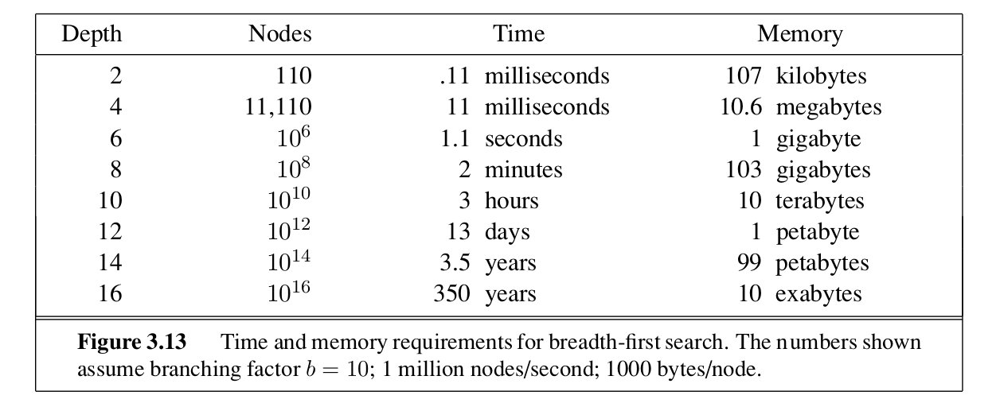
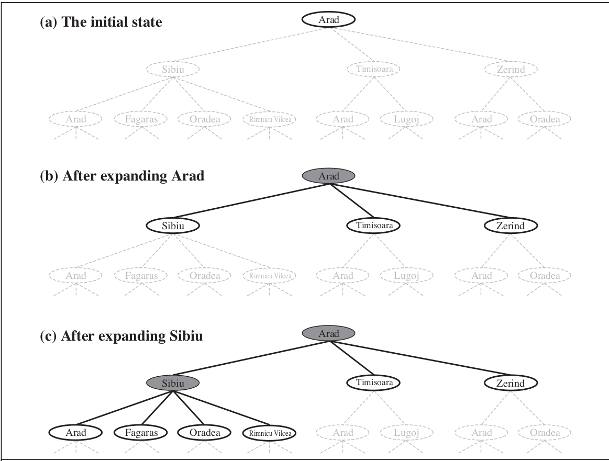
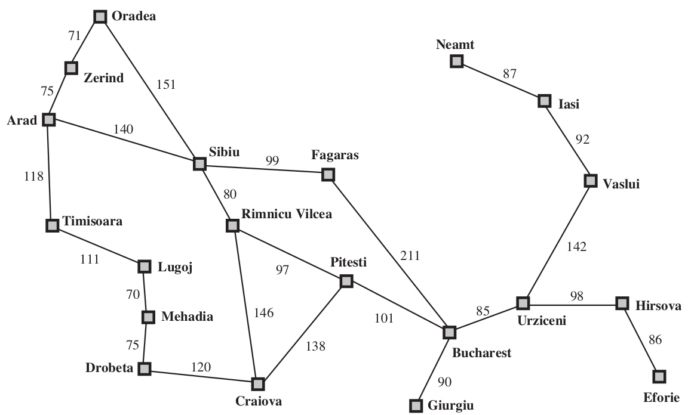
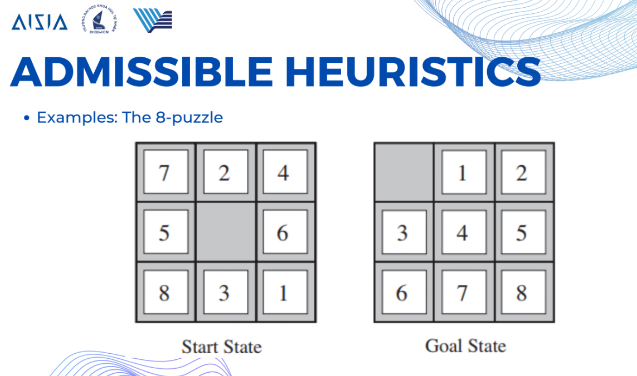

# BÀI TẬP LÝ THUYẾT TUẦN 1

- [BÀI TẬP LÝ THUYẾT TUẦN 1](#bài-tập-lý-thuyết-tuần-1)
  - [Câu 1: BREADTH-FIRST SEARCH](#câu-1-breadth-first-search)
    - [1.1 Complete?](#11-complete)
    - [1.2. Time?](#12-time)
    - [1.3. Space?](#13-space)
    - [1.4. Optimal?](#14-optimal)
    - [1.5. Kết luận](#15-kết-luận)
  - [Câu 2: UNIFORM-COST SEARCH](#câu-2-uniform-cost-search)
    - [2.1. Complete?](#21-complete)
    - [2.2. Time?](#22-time)
    - [2.3. Space?](#23-space)
    - [2.4. Optimal?](#24-optimal)
    - [2.5. Kết luận](#25-kết-luận)
  - [Câu 3: DEPTH-FIRST SEARCH](#câu-3-depth-first-search)
    - [3.1. Complete?](#31-complete)
    - [3.2. Time?](#32-time)
    - [3.3. Space?](#33-space)
    - [3.4. Optimal?](#34-optimal)
    - [3.5. Kết luận](#35-kết-luận)
  - [Câu 4: GREEDY BEST-FIRST SEARCH](#câu-4-greedy-best-first-search)
    - [4.1. Complete?](#41-complete)
    - [4.2. Time?](#42-time)
    - [4.3. Space?](#43-space)
    - [4.4. Optimal?](#44-optimal)
    - [4.5. Kết luận](#45-kết-luận)
  - [Câu 5: ADMISSIBLE HEURISTICS](#câu-5-admissible-heuristics)
    - [HOMEWORK 2](#homework-2)
    - [HOMEWORK 3](#homework-3)
  - [Câu 6: Xác định khoảng cách Manhattan $h(n)$ và sử dụng thuật toán tree-search để giải ví dụ](#câu-6-xác-định-khoảng-cách-manhattan-hn-và-sử-dụng-thuật-toán-tree-search-để-giải-ví-dụ)


## Câu 1: BREADTH-FIRST SEARCH

- Complete?
- Time?
- Space?
- Optimal?

### 1.1 Complete?

Đặt hệ số phân nhánh là $b$, độ sâu là $d$.Thuật toán tìm kiếm theo chiều rộng (Breadth-first search) sẽ **complete**. Điều này nghĩa là nếu tồn tại một lời giải ở một độ sâu hữu hạn và hệ số phân nhánh $b$ là hữu hạn, BFS sẽ chắc chắn tìm thấy được nó. Ngược lại nếu đồ thị không hữu hạn hoặc không tồn tại một lời giải nào thì thuật toán BFS sẽ không thể **complete**.

Bởi vì BFS mở rộng theo chiều rộng, nghĩa là sẽ mở rộng các nút ở độ sâu $k$ trước khi chuyển sang nút ở độ sâu $k+1$. Nghĩa là nó khám phá toàn bộ các nút ở một độ sâu nhất định trước khi đi sâu hơn. Tóm lại điều kiện $b$ và $d$ hữu hạn là bắt buộc.

### 1.2. Time?

Với $d$ là độ sâu của lời giải nông nhất, $b$ là hệ số phân nhánh (số lượng nút con của mỗi nút) thì thuật toán BFS có độ phức tạp là $\mathcal{O}(b^d)$. Ta sẽ phân tích chi tiết:

- Ở độ sâu 1, BFS tạo ra $b$ nút.
- Ở độ sâu 2, mỗi nút ở độ sâu mức 1 tạo ra $b$ nút con, tổng cộng $b^2$ nút (chỉ đang tính ở độ sâu 2). 
- Tiếp tục như vậy, ở độ sâu mức $d$, số lượng nút được tạo ra là $b^d$.

Tổng số nút từ độ sâu 1 đến $d$ là:

$$
b + b^2 + b^3 + \dots + b^d = \mathcal{O}(b^d)
$$

Số hạng $b^d$ lớn nhất và chi phối tổng.

**Trường hợp xấu nhất**

Nếu lời giải nằm ở vị trí cuối cùng được khám phá ở mức độ sâu $d$, BFS sẽ phải tạo ra tất cả các nút ở mức độ sâu $d$ trước khi tìm thấy lời giải.

- **Lưu ý về kiểm tra mục tiêu khi mở rộng nút:**

Nếu thuật toán kiểm tra mục tiêu khi **mở rộng** nút thay vì **tạo ra nút**, độ phức tạp thời gian sẽ tăng lên $\mathcal{O}(b^{d+1})$. Sự khác nhau là **mở rộng** nghĩa là nút được lấy ra khỏi **frontier** thì được gọi là mở rộng, **tạo ra nút** nghĩa là thêm nó vào **frontier**.

Ví dụ với mục tiêu tạo ra nút, xét đồ thị sau, giả sử hệ số phân nhánh $b=2$ và lời giải nằm ở $d=3$. Số nút ở mỗi độ sâu:
- **Độ sâu 0:** 1 nút
- **Độ sâu 1:** 2 nút
- **Độ sâu 2:** 4 nút
- **Độ sâu 3:** 8 nút

Tổng cộng số nút được tạo ra là $1+2+4+8=15$

Quá trình diễn ra như sau:
- Khi mở rộng các nút ở độ sâu 2, chúng ta tạo ra các nút ở độ sâu 3
- Ngay khi tạo ra các nút ở độ sâu 3, chúng ta kiểm tra xem chúng có phải mục tiêu không
- Nếu một trong các nút này là mục tiêu, ta ngừng lại.

Ví dụ với mục tiêu mở rộng nút, ta xét tương tự như trên, từ đó có tổng số nút từ độ sâu 0 đến 3 là $15$, các nút ở cấp độ 4 ta tạo ra $2^4=16$ nút mới

Vậy tổng số nút tạo ra là $15+16=31$

Quá trình diễn ra như sau:
- Chúng ta mở rộng tất cả các nút ở độ sâu 0 đến 2 mà không tìm thấy mục tiêu.
- Khi mở rộng các nút ở độ sâu 2, chúng ta tạo ra các nút ở độ sâu 3 và thêm chúng vào **frontier**.
- Không kiểm tra mục tiêu khi tạo ra các nút ở độ sâu 3.
- Tiếp theo, chúng ta bắt đầu mở rộng các nút ở độ sâu 3.
- Trước khi mở rộng nút mục tiêu ở độ sâu 3, chúng ta đã mở rộng các nút khác ở độ sâu 3 và tạo ra các nút ở độ sâu 4.
- Tổng cộng đã có 31 nút trước khi tìm thấy mục tiêu.

Trích dẫn theo sách **AI Russel Norvig** trang 82: 


>If the algorithm were to apply the goal test to nodes when selected for expansion, rather than
when generated, the whole layer of nodes at depth $d$ would be expanded before the goal was
detected and the time complexity would be $\mathcal{O}(b^{d+1})$.

### 1.3. Space?

Độ phức tạp không gian của BFS cũng là $\mathcal{O(b^d)}$

- **Lý do cho độ phức tạp không gian cao:** BFS lưu trữ tất cả các nút đã được tạo ra trong bộ nhớ, bao gồm cả trong **frontier** và **explored set**
- **Số nút trong bộ nhớ:** Có $\mathcal{O}(b^{d-1})$ nút trong **explored set** và $\mathcal{O}(b^{d})$ nút trong **frontier**, do đó tổng số nút cần lưu trữ là $\mathcal{O}(b^{d})$
- **Khó khăn:** Do yêu cầu bộ nhớ tăng theo cấp số mũ với độ sâu $d$, nên nếu $d$ lớn thì sẽ rất tồi tệ. Thậm chí nếu chuyển sang sử dụng cây tìm kiếm cũng không giảm được nhiều không gian lưu trữ hơn bởi vì số nút trong **frontier** quyết định độ phức tạp không gian.

Độ phức tạp theo hàm mũ rất đáng sợ, giả sử hệ số phân tán $b=10$, 1 giây máy tính tạo ra được $1,000,000$ nút và mỗi nút cần 1000 bytes lưu trữ thì ta có bảng sau (trích trong sách **AI Russel Norvig** trang 83):



### 1.4. Optimal?

Thuật toán BFS sẽ được coi là **tối ưu (optimal)** nếu hàm chi phí đường đi tới các nút không giảm theo độ sâu, trường hợp phổ biến là mọi bước đi từ đỉnh này tới đỉnh kề với nó là bằng nhau, nghĩa là chi phí bước đi từ nút $i$ đến nút $j$ là bằng nhau với mọi nút $i,j$ kề nhau trong đồ thị.

BFS tối ưu trong trường hợp này là vì: nó khám phá tất cả các đường đi có độ dài ngắn trước khi xem xét các đường đi dài hơn. Do đó khi tìm thấy nút mục tiêu, thì đó là **đường đi có số bước ít nhất**, và nếu chi phí là như nhau thì còn được gọi là **đường đi có chi phí ít nhất**.

### 1.5. Kết luận

- BFS **complete**: sẽ tìm thấy lời giải nếu chúng tồn tại và đồ thị hữu hạn.
- BFS **optimal**: tìm được đường đi tối ưu trong trường hợp hàm chi phí đồng nhất.
- Độ phức tạp thời gian cao, tăng theo hàm mũ với độ sâu $d$.
- Độ phức tạp không gian cao, chiếm rất nhiều bộ nhớ nếu $b$ và $d$ không đủ bé.

## Câu 2: UNIFORM-COST SEARCH

### 2.1. Complete?

Thuật toán Uniform-cost search có **complete**. UCS luôn mở rộng nút có chi phí đường đi thấp nhất trước. Nếu chi phí đường mỗi bước đi luôn lớn hơn hay bằng một hằng số dương nhỏ $\epsilon$, và nếu tồn tại một lời giải với tổng chi phí hữu hạn, thì số lượng các nút có chi phí nhỏ hơn hoặc bằng chi phí tối ưu $C^*$ là hữu hạn, UCS sẽ hoàn thành việc tìm kiếm sau mốt số bước hữu hạn. Tóm lại điều kiện không có chu trình với tổng chi phí âm và chi phí mỗi bước đi là lớn hơn số đủ nhỏ $\epsilon > 0$

### 2.2. Time?

Giả sử $C^*$ là chi phí cho lời giải tối ưu, $\epsilon > 0$ là chi phí nhỏ nhất cho mỗi bước đi, $b$ là hệ số phân nhánh (số lượng nút con của mỗi nút) thì thuật toán UCS có độ phức tạp thời gian là $\displaystyle\mathcal{O}(b^{\lfloor 1 + C^* / \epsilon \rfloor})$ nó có thể lớn hơn $\mathcal{O}(b^d)$ bởi vì UCS sẽ khám phá một **cây lớn** của các step nhỏ trước khi khám phá những đường có chi phí cao mà có thể sẽ hữu ích. 

Vậy độ phức tạp thời gian sẽ rất lớn nếu chi phí đường đi tối ưu $C^*$ quá lớn hay $\epsilon$ quá nhỏ, vì nó đi thăm các đường có chi phí nhỏ trước khi khám phá đường có chi phí lớn. Ví dụ có rất rất nhiều đường có chi phí rất nhỏ nhưng không dẫn đến đích thì thuật toán sẽ mở rộng hết chúng gây mất thời gian. 

### 2.3. Space?

Độ phức tạp không gian của UCS cũng là $\displaystyle\mathcal{O}\left(b^{1 + \left\lfloor \frac{C^*}{\epsilon} \right\rfloor}\right)$, UCS lưu tất cả các nút trong **frontier (ở đây là hàng đợi ưu tiên)**, chưa tính các nút trong **explored set** nhưng tương tụ BFS thì số lượng nút trong **frontier** chi phối độ phức tạp. Nó cần lưu trữ tất cả đường đi có chi phí bé hơn hoặc bằng $C^*$.

### 2.4. Optimal?

Thuật toán UCS được gọi là **tối ưu (optimal)** nếu nó tìm được đường đi có tổng chi phí thấp nhất tới mục tiêu. UCS mở rộng các nút theo thứ tự tăng dần của chi phí đường đi, khi UCS mở rộng tới nút mục tiêu, đó là đường đi có chi phí thấp nhất tới mục tiêu.

Vậy UCS sẽ **tối ưu** nếu tất cả các bước đi đều không âm và lớn hơn số $\epsilon > 0$ đủ bé.

### 2.5. Kết luận

- UCS **complete** nếu chi phí mỗi bước đi lớn hơn $\epsilon > 0$.
- Tối ưu: UCS là tối ưu khi tất cả các chi phí bước đi không âm.
- Độ phức tạp thời gian và không gian: Có thể rất lớn, phụ thuộc vào $\displaystyle\frac{C^*}{\epsilon}$ và hệ số phân nhánh $b$.
- Ưu điểm: Đảm bảo tìm được đường đi có chi phí thấp nhất.
- Nhược điểm: Yêu cầu bộ nhớ lớn và thời gian xử lý dài trong các không gian trạng thái lớn hoặc khi $\epsilon$ rất nhỏ.

## Câu 3: DEPTH-FIRST SEARCH

### 3.1. Complete?

**Xét DFS phiên bản tree search**

DFS không **complete** trong không gian trạng thái hữu hạn có chu trình hoặc không gian trạng thái vô hạn. Lý do là vì DFS có thể đi sâu vào một nhánh vô hạn hoặc lặp lại các trạng thái đã thăm mà không bao giờ tìm thấy lời giải.

**Xét DFS phiên bản graph search**

DFS **complete** trong không gian trạng thái hữu hạn nếu tránh được các trạng thái lặp, bằng cách lưu trữ các trạng thái đã thăm vào tập hợp **explored set**, DFS có thể tránh lặp và trở nên **complete**.

Vậy DFS phiên bản graph search thì complete còn phiên bản tree search thì không. 

Trích dẫn trong sách **AI Russel Norvig trang 86**:
>The tree-search version... is not complete—for example, in Figure 3.6 the algorithm will follow the Arad–Sibiu–Arad–Sibiu loop forever



### 3.2. Time?

Trong trường hợp xấu nhất, DFS có thể phải mở rộng tất cả các nút trong cây tìm kiếm trước khi thấy lời giải hoặc kết luận rằng không có lời giải. Số lượng nút tối đa là $\mathcal{O}(b^m)$, với:
- $b$ là hệ số phân nhánh (số lượng nút con của mỗi nút).
- $m$ là độ sâu tối đa của cây tìm kiếm.

Nếu độ sâu tối đa $m$ lớn hoặc vô hạn, độ phức tạp thời gian của DFS sẽ rất lớn. DFS có thể không hiệu quả nếu lời giải nằm ở phần nông của cây nhưng DFS lại đi sâu vào các nhánh khác trước.

Ví dụ như không gian trạng thái sau:

```
'A': ['B', 'C']
'B': ['D'],
'C': ['E'],
'D': ['F'],
'E' : [],
'F' : []
```

Nếu cần tìm đường từ `'A'` đến `'E'` thì DFS có thể đi quá sâu vào `A -> B -> D -> F` xong mới quành lại và đi vào `C -> E`.

### 3.3. Space?

DFS chỉ cần lưu trữ một đường đi từ nút gốc đến nút hiện tại và các nút anh em chưa được mở rộng. Độ phức tạp không gian là $\mathcal{O}(bm)$. 

Trích dẫn trong sách **AI Russel Norvig trang 87**:
> For a state space with branching factor $b$ and maximum depth $m$, depth-first search requires storage of only $O(bm)$ nodes.

Vậy DFS phù hợp cho các bài toán có không gian trạng thái lớn hoặc khi bộ nhớ hạn chế.

### 3.4. Optimal?

DFS không tối ưu vì nó có thể tìm thấy lời giải không phải là lời giải tốt nhất (ngắn nhất hoặc có chi phí thấp nhất). DFS không xem xét tất cả các lời giải trước khi quyết định chọn lời giải tốt nhất. 

### 3.5. Kết luận

- DFS phiên bản tree search không **complete** trong không gian trạng thái vô hạn hoặc có chu trình.
- DFS phiên bản graph search **complete** trong không gian trạng thái hữu hạn nếu tránh lặp trạng thái.
- DFS không **optimal**, có thể không tìm được lời giải tốt nhất.
- Độ phức tạp thời gian trong trường hợp xấu nhất là $\mathcal{O}(b^m)$, có thể rất lớn nếu $m$ lớn.
- Độ phức tạp không gian là một ưu điểm lớn với chỉ $\mathcal{O}(bm)$

## Câu 4: GREEDY BEST-FIRST SEARCH

### 4.1. Complete?



Thuật toán Greedy Best-First Search không **complete** trong phiên bản tree search, ngay cả khi trong trạng thái không gian hữu hạn. Điều này có nghĩa là thuật toán GBFS có thể không tìm thấy lời giải dù lời giải đó tồn tại trong trạng thái không gian hữu hạn.

Xét một ví dụ với **Romania Map** phía trên, ta sẽ dùng thuật toán GBFS tìm đường đi từ `Iasi` tới `Faragas` với hàm heuristic $h(n)$ là khoảng cách đường thẳng đến `Faragas`. Lúc này GBFS sẽ thực hiện như sau:
- Mở rộng sang `Neamt` trước bởi vì $h(\text{Neamt})$ là nhỏ nhất, nhưng `Neamt` là ngõ cụt. 
- Quay lại `Iasi`: lúc này $h(\text{Iasi})$ nhỏ hơn các lựa chọn khác nên lại được thêm vào **frontier**.
- Vòng lặp vô hạn: Nó sẽ lặp lại bước 1 và bước 2 mà không thể tìm đến được `Faragas`, vì đây là phiên bản tree search.

Greedy Best-First Search phiên bản graph search sẽ **complete** trong không gian trạng thái hữu hạn, vì nó tránh được việc mở rộng lại các nút đã được thăm.

### 4.2. Time?

Độ phức tạp thời gian của GBFS phụ thuộc vào chất lượng của hàm heuristic $h(n)$. Từ đó trường hợp xấu nhất là $\mathcal{O}(b^m)$ với $b$ là hệ số phân tán, $m$ là độ sâu tối đa của không gian trạng thái. Nếu hàm heuristic tốt, GBFS sẽ nhanh chóng tìm ra lời giải, mở rộng ít nút hơn.

Trích từ sách **AI Russel Norvig trang 93**
>The worst-case time and space complexity for the tree version is $O(b^m)$, where $m$ is the maximum depth of the search space. With a good heuristic function, however, the complexity can be reduced substantially.

### 4.3. Space?

Độ phức tạp không gian của GBFS là $\mathcal{O}(b^m)$ bởi vì **frontier** lưu trữ tất cả các nút đã được tạo ra với sự ưu tiên dựa trên $h(n)$. Nếu heuristic tốt nó có thể giảm được số lượng nút cần lưu trữ.

### 4.4. Optimal?

GBFS không **optimal**, nó không đảm bảo tìm được đường đi ngắn nhất bởi vì chỉ dựa trên $h(n)$, không xem xét chi phí từ nút gốc đến nút hiện tại. Ta xét một ví dụ cũng từ bản đồ trên, tìm đường đi từ `Arad` tới `Bucharest`:

Dựa vào hàm heuristic là $h(n)$ là khoảng cách đường thẳng. GBFS sẽ chọn đường đi như sau: `Arad` $\to$ `Sibiu` $\to$ `Faragas` $\to$ `Bucharest` với chi phí là $140+99+211=450$ trong khi đường đi tối ưu là `Arad` $\to$ `Sibiu` $\to$ `Rimnicu Vilcea` $\to$ `Pitesti` $\to$ `Bucharest` với chi phí là $140+80+97+101=418$

### 4.5. Kết luận

- GBFS không **complete** trong tìm kiếm trên cây, **complete** trong tìm kiếm trên đồ thị hữu hạn.
- Độ phức tạp thời gian $\mathcal{O}(b^m)$, nhưng có thể cải thiện với heuristic tốt.
- Độ phức tạp không gian $\mathcal{O}(b^m)$, phụ thuộc vào số nút trong **frontier**.
- GBFS không **optimal**, không đảm bảo tìm được đường đi có chi phí thấp nhất.

## Câu 5: ADMISSIBLE HEURISTICS

### HOMEWORK 2

Chứng minh định lý sau:

>**Định lý:** Nếu $h(n)$ là admissible, $\text{A}^*$ sử dụng Tree-Search là tối ưu (optimal).

Ta có định nghĩa của admissible heuristics:

> **Định nghĩa:** Hàm heuristic $h(n)$ được gọi là admissible nếu với mọi nút $n$, $h(n) \leq h^*(n)$, trong đó $h^*(n)$ là chi phí thực tế thấp nhất từ $n$ đến nút đích.

Gọi $C^*$ là chi phí của lời giải tối ưu từ nút bắt đầu tới nút đích. 

Giả sử có một nút đích không tối ưu (suboptimal goal) G2 nằm trong **fringe**, ta chứng minh rằng $f(\text{G2}) > C^*$.
- Vì G2 là một lời giải không tối ưu, nên chi phí thực tế của nó $g(\text{G2}) > C^*$
- Vì G2 là một nút đích, nên $h(G2)=0$
- Từ đó ta có $f(\text{G2}) = g(\text{G2}) + h(\text{G2}) = g(\text{G2}) + 0 = g(\text{G2})$

Vậy $$\begin{equation} f(\text{G2}) > C^* \tag{1} \end{equation}$$

Xét một nút $n$ nằm trên đường đi tối ưu và ở trong **fringe**, ta chứng minh rằng $f(n) \leq C^*$
- Vì $n$ nằm trên đường đi tối ưu, nên tổng chi phí từ nút bắt đầu qua $n$ xong tới đích là $C^*$
- Chi phí từ nút bắt đầu tới $n$ là $g(n)$
- Chi phí thực tế từ $n$ đến đích là $h^*(n)$, theo định nghĩa thì $g(n)+h^*(n) = C^*$
- Vì $h(n)$ là admissible, nên $h(n) \leq h^*(n)$
- Từ đó ta có $f(n) = g(n) + h(n) \leq g(n) + h^*(n) = C^*$

Vậy $$\begin{equation} f(\text{n}) \leq C^* \tag{2} \end{equation}$$

Từ $(1)$ và $(2)$ ta có được 
$$
\begin{equation}
f(n) \leq C^* < f(G2)
\tag{3}
\end{equation}
$$

Điều này có nghĩa là mọi nút $n$ trên đường đi tối ưu sẽ có giá trị $f(n)$ nhỏ hơn $f(\text{G2})$. Mà thuật toán $\text{A}^*$ luôn mở rộng nút tong **fringe** có giá trị $f(n)$ nhỏ nhất, kết hợp với $(3)$ nên $\text{A}^*$ luôn mở rộng các nút nằm trên đường đi tối ưu trước khi G2 được xem xét.

Từ đó $\text{A}^*$ sẽ tìm thấy lời giải tối ưu với chi phí $C^*$ trước khi mở rộng bất kỳ nút đích không tối ưu nào.

Vậy ta chứng minh được $\text{A}^*$ sử dụng Tree-Search với heuristic admissible được sẽ luôn tìm được lời giải tối ưu.

### HOMEWORK 3

Code báo cáo đã ghi rõ trong 2 file `homework3_8puzzle.py` và `homework3_8queens.py`, thầy cô có thể vào xem. Sau đây là thống kê của 4 thuật toán **hill climbing steepest-ascent**, **hill climbing first-choice variants**, **hill climbing with random restart** và **simulated annealing** sau 1000 lần tạo ra trạng thái ban đầu ngẫu nhiên có thể giải được, trong đó có:
- số lần giải được bài toán `solved`.
- số lần không giải được bài toán `cannot_solved`.
- trung bình chi phí tìm kiếm `mean_search_cost` (ở đây là số successors được tạo ra).
- tỉ lệ thành công `percentage`.

**BÀI TOÁN 8-PUZZLE**

|algorithm|solved|cannot_solved|mean_search_cost|percentage|
|-|-|-|-|-|
|hill_climbing_steepest_ascent|7|993|10.761|0.007|
|hill_climbing_first_choice|7|993|8.436|0.007|
|hill_climbing_random_restart|21|979|103.672|0.021|
|simulated_annealing|101|899|2976.982|0.101|

**BÀI TOÁN 8-QUEENS**

|algorithm|solved|cannot_solved|mean_search_cost|percentage|
|-|-|-|-|-|
|hill_climbing_steepest_ascent|145|855|233.731|0.145
|hill_climbing_first_choice|126|874|100.401|0.126
|hill_climbing_random_restart|1000|0|1578.076|1.0
|simulated_annealing|596|404|2834.16|0.596


## Câu 6: Xác định khoảng cách Manhattan $h(n)$ và sử dụng thuật toán tree-search để giải ví dụ



Với mỗi trạng thái `state` gọi H(state) là khoảng cách Manhattan sau đây là sử dụng A* tree-search để giải bài toán 8-puzzle này:

```
State:
[7, 2, 4]
[5, 0, 6]   H(state)= 18
[8, 3, 1]

State:
[7, 2, 4]
[0, 5, 6]   H(state)= 17
[8, 3, 1]

State:
[0, 2, 4]
[7, 5, 6]   H(state)= 16
[8, 3, 1]

State:
[2, 0, 4]
[7, 5, 6]   H(state)= 17
[8, 3, 1]

State:
[2, 5, 4]
[7, 0, 6]   H(state)= 18
[8, 3, 1]

State:
[2, 5, 4]
[7, 6, 0]   H(state)= 17
[8, 3, 1]

State:
[2, 5, 4]
[7, 6, 1]   H(state)= 16
[8, 3, 0]

State:
[2, 5, 4]
[7, 6, 1]   H(state)= 17
[8, 0, 3]

State:
[2, 5, 4]
[7, 6, 1]   H(state)= 16
[0, 8, 3]

State:
[2, 5, 4]
[0, 6, 1]   H(state)= 15
[7, 8, 3]

State:
[2, 5, 4]
[6, 0, 1]   H(state)= 14
[7, 8, 3]

State:
[2, 5, 4]
[6, 1, 0]   H(state)= 13
[7, 8, 3]

State:
[2, 5, 4]
[6, 1, 3]   H(state)= 12
[7, 8, 0]

State:
[2, 5, 4]
[6, 1, 3]   H(state)= 11
[7, 0, 8]

State:
[2, 5, 4]
[6, 1, 3]   H(state)= 10
[0, 7, 8]

State:
[2, 5, 4]
[0, 1, 3]   H(state)= 9
[6, 7, 8]

State:
[2, 5, 4]
[1, 0, 3]   H(state)= 10
[6, 7, 8]

State:
[2, 5, 4]
[1, 3, 0]   H(state)= 9
[6, 7, 8]

State:
[2, 5, 0]
[1, 3, 4]   H(state)= 8
[6, 7, 8]

State:
[2, 0, 5]
[1, 3, 4]   H(state)= 7
[6, 7, 8]

State:
[0, 2, 5]
[1, 3, 4]   H(state)= 6
[6, 7, 8]

State:
[1, 2, 5]
[0, 3, 4]   H(state)= 5
[6, 7, 8]

State:
[1, 2, 5]
[3, 0, 4]   H(state)= 4
[6, 7, 8]

State:
[1, 2, 5]
[3, 4, 0]   H(state)= 3
[6, 7, 8]

State:
[1, 2, 0]
[3, 4, 5]   H(state)= 2
[6, 7, 8]

State:
[1, 0, 2]
[3, 4, 5]   H(state)= 1
[6, 7, 8]

State:
[0, 1, 2]
[3, 4, 5]   H(state)= 0
[6, 7, 8]
```

Tổng cộng mất 26 bước đi.