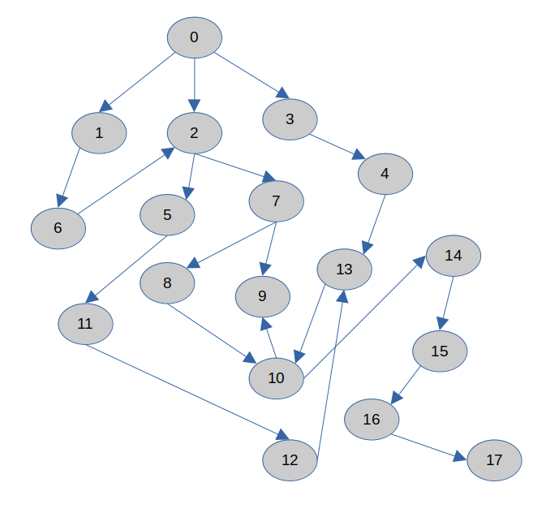
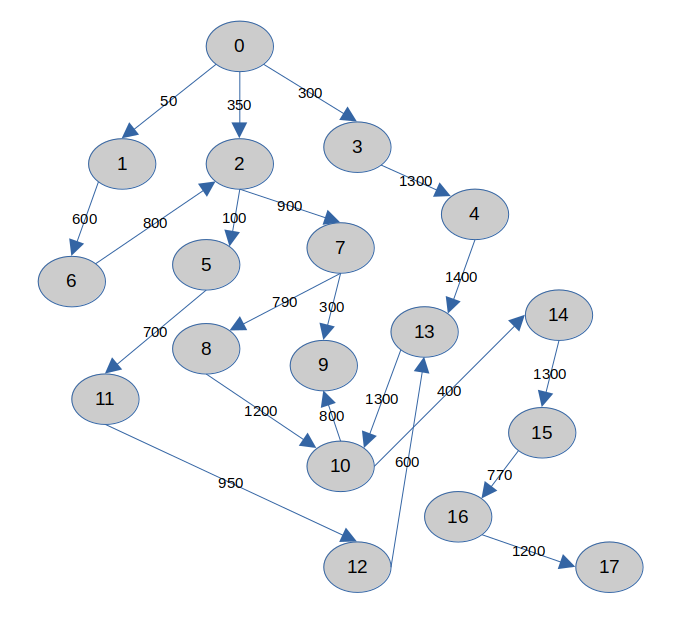

# BÁO CÁO BÀI TẬP THỰC HÀNH TUẦN 1

```
Họ tên: Lý Quang Thắng
MSSV: 22110202
```

- [BÁO CÁO BÀI TẬP THỰC HÀNH TUẦN 1](#báo-cáo-bài-tập-thực-hành-tuần-1)
  - [1. Chạy tay thuật toán BFS, DFS và UCS](#1-chạy-tay-thuật-toán-bfs-dfs-và-ucs)
    - [1.1. BFS](#11-bfs)
    - [1.2. DFS](#12-dfs)
    - [1.3. UCS](#13-ucs)
  - [2. Kiểm tra tính đúng đắn của các thuật toán đã cho sẵn code như trên. Nếu chưa đúng thì em sửa lại như thế nào cho phù hợp?](#2-kiểm-tra-tính-đúng-đắn-của-các-thuật-toán-đã-cho-sẵn-code-như-trên-nếu-chưa-đúng-thì-em-sửa-lại-như-thế-nào-cho-phù-hợp)
    - [2.1. Sự dư thừa khi thêm node start vào visited khi khởi tạo thuật toán](#21-sự-dư-thừa-khi-thêm-node-start-vào-visited-khi-khởi-tạo-thuật-toán)
    - [2.2. Sai lầm logic khi thêm các trạng thái có thể xảy ra tiếp theo vào visited](#22-sai-lầm-logic-khi-thêm-các-trạng-thái-có-thể-xảy-ra-tiếp-theo-vào-visited)
    - [2.3. Không đảm bảo cập nhật trọng số tối ưu trong Uniform Cost Search](#23-không-đảm-bảo-cập-nhật-trọng-số-tối-ưu-trong-uniform-cost-search)
  - [3. Sửa lại code](#3-sửa-lại-code)
    - [3.1. BFS](#31-bfs)
    - [3.2. DFS](#32-dfs)
    - [3.3. UCS](#33-ucs)
  - [4. Nhận xét gì về kết quả chạy tay với kết quả chạy trên máy tính.](#4-nhận-xét-gì-về-kết-quả-chạy-tay-với-kết-quả-chạy-trên-máy-tính)
    - [4.1. BFS](#41-bfs)
    - [4.2. DFS](#42-dfs)
    - [4.3. UCS](#43-ucs)
    - [4.4. Tổng kết lại](#44-tổng-kết-lại)


## 1. Chạy tay thuật toán BFS, DFS và UCS

Ta có đồ thị từ file `Input.txt` được chuyển về dạng graph như sau:



### 1.1. BFS

Giả sử xét những node đã được thăm là những - Node x, ví dụ

- Node = 1, ...
- Node = 2, ...
- Node = 1 (tại đây không thêm 1 vào hàng đợi vì 1 đã được thăm)

Tiến hành giải tay:

- L = [0] (trạng thái ban đầu)
- Node = 0, L = [1, 2, 3], father[1, 2, 3] = 0
- Node = 1, L = [2, 3, 6], father[6] = 1
- Node = 2, L = [3, 6, 5, 7], father[5, 7] = 2
- Node = 3, L = [6, 5, 7, 4], father[4] = 3
- Node = 6, L = [5, 7, 4] (đỉnh 6 có đường đi tới đỉnh 2 nhưng đỉnh 2 đã được thăm nên bỏ qua), father[2] = 0, 6
- Node = 5, L = [7, 4, 11], father[11] = 5
- Node = 7, L = [4, 11, 8, 9], father[8, 9] = 7
- Node = 4, L = [11, 8, 9, 13], father[13] = 4
- Node = 11, L = [8, 9, 13, 12], father[12] = 11
- Node = 8, L = [9, 13, 12, 10], father[10] = 8
- Node = 9, L = [13, 12, 10]
- Node = 13, L = [12, 10] (đỉnh 13 có đường đi đến đỉnh 10 nhưng đỉnh 10 đã được thăm nên bỏ qua), father[10] = 8, 13
- Node = 12, L = [10] (đỉnh 12 có đường đi đến đỉnh 13 nhưng đỉnh 13 đã được thăm nên bỏ qua), father[13] = 4, 12
- Node = 10, L = [14] (đỉnh 10 có đường đi đến đỉnh 9 nhưng đỉnh 9 đã được thăm nên bỏ qua), father[14] = 10, father[9] = 7, 10
- Node = 14, L = [15], father[15] = 14
- Node = 15, L = [16], father[16] = 15
- Node = 16, L = [17], father[17] = 16
- Node = 17 (trạng thái kết thúc) $\to$ dừng

$\Rightarrow$ đường đi từ đỉnh 0 tới đỉnh 17 là: 

- $0\to 3\to 4\to 13\to 10\to 14\to 15\to 16\to 17$
- $0\to 2\to 7\to 8\to 10\to 14\to 15\to 16\to 17$

### 1.2. DFS

Những node đã được thăm cũng xét tương tự với thuật toán BFS

Tiến hành giải tay:

- L = [0] (trạng thái ban đầu)
- Node = 0, L = [3, 2, 1], father[3, 2, 1] = 0
- Node = 3, L = [4, 2, 1], father[4] = 3
- Node = 4, L = [13, 2, 1], father[13] = 4
- Node = 13, L = [10, 2, 1], father[10] = 13
- Node = 10, L = [14, 9, 2, 1] father[14, 9] = 10
- Node = 14, L = [15, 9, 2, 1], father[15] = 14
- Node = 15, L = [16, 9, 2, 1], father[16] = 15
- Node = 16, L = [17, 9, 2, 1], father[17] = 16
- Node = 17 (trạng thái kết thúc) $\to$ dừng

$\Rightarrow$ đường đi từ đỉnh 0 tới 17 là:

- $0\to 3\to 4\to 13\to 10\to 14\to 15\to 16\to 17$

### 1.3. UCS

Ta xét đồ thị có hướng có trọng số được chuyển đổi từ file `InputUCS.txt`



Tiến hành giải tay:

- PQ = {(0, 0)} (PQ là Priority Queue)
- PQ = {(1, 50), (3, 300), (2, 350)}
- PQ = {(3, 300), (2, 350), (6, 650)}
- PQ = {(2, 350), (6, 650), (4, 1600)}
- PQ = {(5, 450), (6, 650), (7, 1250), (4, 1600)}
- PQ = {(6, 650), (11, 1150), (7, 1250), (4, 1600)}
- PQ = {(11, 1150), (7, 1250), (4, 1600)}
- PQ = {(7, 1250), (4, 1600), (12, 2100)}
- PQ = {(9, 1550), (4, 1600), (8, 2040), (12, 2100)}
- PQ = {(4, 1600), (8, 2040), (12, 2100)}
- PQ = {(8, 2040), (12, 2100), (13, 3000)}
- PQ = {(12, 2100), (13, 3000), (10, 3240)}
- PQ = {(13, 2700), (13, 3000), (10, 3240)} có đường đi mới đến 13 có chi phí ít hơn
- PQ = {(13, 3000), (10, 3240)}
- PQ = {(10, 3240)} có đường mới đến 13 với chi phí cao hơn 13 đã có trong PQ nên bỏ qua
- PQ = {(14, 3640)}
- PQ = {(15, 4940)}
- PQ = {(16, 5710)}
- PQ = {(17, 6910)}

Vậy đường đi từ 0 đế 17 với chi phí ít nhất là:

- $0\to 2\to 7\to 8\to 10\to 14\to 15\to 16\to 17$ với chi phí là 6910

## 2. Kiểm tra tính đúng đắn của các thuật toán đã cho sẵn code như trên. Nếu chưa đúng thì em sửa lại như thế nào cho phù hợp?

### 2.1. Sự dư thừa khi thêm node start vào visited khi khởi tạo thuật toán

Trong cả 3 thuật toán đã cho code sẵn đều có lỗi chung như sau:
- Thêm vào node start vào trong visited khi vừa khởi tạo các frontier, visited, parent

```python
    #### BFS ####

    visited = []
    frontier = Queue()

    # thêm node vào frontier và visited
    frontier.put(start)
    visited.append(start) # không cần thiết (sẽ viết rõ trong báo cáo)
```

```python
    #### DFS ####

    visited = []
    frontier = [] # list for stack

    # thêm node start vào frontier và visited
    frontier.append(start)
    visited.append(start) # không cần thiết (sẽ viết rõ trong báo cáo)
```

```python
    #### UCS ####

    visited = []
    frontier = PriorityQueue()
    # thêm node start vào frontier và visited
    frontier.put((0, start))
    visited.append(start) # không cần thiết (sẽ viết rõ trong báo cáo)
```

Theo em thì phần này sẽ không ảnh hưởng đến kết quả của thuật toán bởi vì ngay sau khi lệnh `visited.append(start)` này thì sẽ vào vòng lặp của thuật toán, từ đó khi node start được lấy ra khỏi `frontier` thì nó chắc chắn sẽ được thêm vào visited, ví dụ như code của BFS sau:

```python
while True:
    if frontier.empty():
        raise Exception("No way Exception")
    current_w, current_node = frontier.get()
    visited.append(current_node) # <- sẽ được thêm vào ở dòng code này
    # ...
```

Em đã thử return thêm list visited trong mỗi thuật toán và đều nhận về kết quả tương tự cho dòng lệnh này `print(visited[:3])` như sau

```output
[0, 0, 1]
```

Nghĩa là mọi lần chạy thuật toán thì start đều được append 2 lần vào visited tạo ra sự dư thừa.

Tương tự với DFS và UCS cũng như vậy, em sẽ sửa lại như sau: xóa bỏ dòng `visited.append(start)` mỗi khi khởi tạo bài toán để đỡ dư thừa trong quá trình chạy code.

### 2.2. Sai lầm logic khi thêm các trạng thái có thể xảy ra tiếp theo vào visited

Trong cả ba thuật toán BFS, DFS, và UCS, có một sai lầm logic phổ biến có thể ảnh hưởng đến kết quả của thuật toán, đó là việc thêm các trạng thái tiếp theo (các node kề) vào danh sách `visited` trước khi node đó được lấy ra khỏi hàng đợi `queue` hoặc ngăn xếp `stack`. Điều này không tuân theo logic chính xác của các thuật toán duyệt đồ thị.

```python
    #### BFS ####

    for node in graph[current_node]:
        if node not in visited:
            frontier.put(node)
            parent[node] = current_node
            visited.append(node) # sai logic khi append vào đây (sẽ viết rõ trong báo cáo)
```


```python
    #### DFS ####

    for node in graph[current_node]:
        if node not in visited:
            frontier.append(node)
            parent[node] = current_node
            visited.append(node) # sai logic khi append vào đây (sẽ viết rõ trong báo cáo)
```

```python
    #### UCS ####

    for nodei in graph[current_node]:
        node, weight = nodei
        if node not in visited:
            frontier.put((current_w + weight, node))
            parent[node] = current_node
            visited.append(node) # sai logic khi append vào đây (sẽ viết rõ trong báo cáo)
```

Một `node` chỉ được coi là đã thăm khi nó được lấy ra khỏi **hàng đợi** hoặc **ngăn xếp** để xử lý, tức là sau khi tất cả các node kề của nó đã được đưa vào hàng đợi/ngăn xếp. Nếu một node được thêm vào `visited` quá sớm, nó sẽ bị đánh dấu là "đã thăm" ngay cả khi chưa thực sự được xử lý, dẫn đến bỏ qua các đường đi tiềm năng khác có thể đến node này qua những node khác.

**Giải pháp:** Để sửa thì em nghĩ nên xóa bỏ dòng `visited.append(node)` trong mỗi thuật toán ở vòng for, như vậy sẽ phù hợp về mặt logic. Và để tránh sẽ có nhiều giá trị trùng lặp trong `frontier`, trong vòng for em kiểm tra nó phải vừa không năm trong `visited` và không ở trong `frontier`

- Với **BFS** và **DFS**, chỉ cần đảm bảo rằng node được thêm vào `visited` sau khi nó được lấy ra từ `frontier`. Ngoài ra, ta có thể kiểm tra thêm điều kiện để `node` không được thêm lại vào `frontier` nếu nó đã có trong `visited` hoặc trong hàng đợi.

```python
if node not in visited and node not in frontier.queue:
    frontier.put(node)
    parent[node] = current_node
```

- Với **UCS**, thì chỉ cần bỏ đi phần kiểm tra `visited` nhưng không thêm ràng buộc kiểm tra trong `frontier` bởi vì nếu có một đường đi từ gốc tới nó có chi phí tốt hơn thì việc kiểm tra trong `frontier` sẽ khiến nó không được thêm vào, ta cần đảm bảo rằng nếu có một đường đi mới rẻ hơn đến node đã có trong hàng đợi, chi phí của node đó cần được cập nhật. Điều này sẽ được giải thích rõ trong phần tiếp theo [2.3.](#23-không-đảm-bảo-cập-nhật-trọng-số-tối-ưu-trong-uniform-cost-search)

### 2.3. Không đảm bảo cập nhật trọng số tối ưu trong Uniform Cost Search 

Khi đã xử lý xong việc append node trong vòng for nhưng vẫn còn điểm chưa đúng trong thuật toán Uniform Cost Search, ta xét ví dụ sau:

Đây là `ví dụ 2.3.1` trong file Code

```python
graph_3 = {
    'A': [('B', 1), ('C', 5)],
    'B': [('C', 1), ('D', 4)],
    'C': [('D', 1)],
    'D': []
}

cost, path = UCS(start='A', end='D', graph=graph_3)
print("Chi phí tiêu tốn:", cost)
print("Đường đi", path) # kết quả nên là A -> B -> C -> D với chi phí = 3
```
Output:
```output
Chi phí tiêu tốn: 5
Đường đi ['A', 'B', 'D']
```

Trong khi dễ dàng quan sát được đường đi ít tốn chi phí nhất là $A \to B \to C \to D$ với chỉ 3. Là do ta không cập nhật những trọng số mà tối ưu hơn khi duyệt các node kề với đỉnh.


**Giải pháp:** Ta cần có thêm một dictionary để lưu lại chi phí đường đi đến mỗi node từ điểm bắt đầu, đảm bảo rằng chúng ta luôn theo dõi chi phí thấp nhất và cập nhật nó khi tìm thấy một đường đi ngắn hơn.

```python
cost = dict()
cost[start] = 0 # Chi phí từ điểm bắt đầu đến chính nó là 0
```

**Điều kiện thêm vào hàng đợi:**

Khi duyệt qua các node kề của `current_node`, ta cần tính toán tổng chi phí của đường đi từ điểm bắt đầu đến node kề này. Sau đó, điều kiện để thêm node vào hàng đợi `frontier` sẽ là:

- Node chưa được thăm: Đảm bảo node chưa được duyệt qua.
- Tìm thấy đường đi rẻ hơn: Nếu đã có chi phí đến node này nhưng đường đi mới tìm thấy rẻ hơn, ta sẽ cập nhật lại chi phí.

```python
for nodei in graph[current_node]:
    node, weight = nodei
    new_cost = current_w + weight

    # Nếu node chưa được thăm hoặc tìm thấy đường đi rẻ hơn
    if node not in visited and (node not in cost or new_cost < cost[node]):
        cost[node] = new_cost
        frontier.put((new_cost, node))
        parent[node] = current_node
```

Điều kiện này đảm bảo rằng node chỉ được thêm vào hàng đợi nếu chưa được thăm hoặc nếu chi phí để đến node này qua đường đi mới rẻ hơn chi phí đã lưu trước đó. Cơ chế này không chỉ giúp tránh thêm node nhiều lần, mà còn đảm bảo rằng thuật toán luôn ưu tiên duyệt các đường đi có chi phí thấp hơn, từ đó tìm ra đường đi ngắn nhất.

**Giải thích chi tiết code trên:**

- `new_cost = current_w + weight:` Tính toán chi phí từ điểm bắt đầu đến `node` qua `current_node`. Tổng chi phí này là chi phí đến `current_node` cộng thêm trọng số của cạnh nối `current_node` và `node`.

- `if node not in visited and (node not in cost or new_cost < cost[node]):` Đây là phần quan trọng của thuật toán UCS. Nó đảm bảo rằng:

  - Node chỉ được thêm vào hàng đợi nếu nó chưa được thăm.
  - Nếu node đã có trong `cost` (tức là đã có một đường đi tới nó), ta chỉ cập nhật nếu đường đi mới tìm thấy rẻ hơn so với đường đi cũ.
  cost[node] = new_cost: Cập nhật chi phí ngắn nhất tới node đó.

- `frontier.put((new_cost, node)):` Thêm node vào hàng đợi ưu tiên với chi phí mới. Vì UCS sử dụng **PriorityQueue**, node có chi phí thấp nhất sẽ được lấy ra trước để duyệt tiếp.

- `parent[node] = current_node:` Lưu lại node cha (node trước đó) để có thể xây dựng lại đường đi ngắn nhất sau khi tìm được đích đến.

**Lợi ích của giải pháp**

- Đảm bảo tính tối ưu: Sử dụng `dictionary cost` giúp đảm bảo rằng mỗi node luôn được duyệt với chi phí thấp nhất. Điều này rất quan trọng trong `UCS`, vì thuật toán hoạt động dựa trên việc so sánh chi phí để tìm đường đi tối ưu.

- Giảm trùng lặp: Điều kiện `new_cost < cost[node]` giúp loại bỏ việc thêm node nhiều lần với các chi phí khác nhau, từ đó giảm thiểu trùng lặp và tăng hiệu suất của thuật toán.

- Xây dựng đường đi chính xác: Với việc cập nhật `parent[node] = current_node` mỗi khi tìm thấy đường đi tốt hơn, chúng ta đảm bảo rằng đường đi từ điểm bắt đầu đến điểm kết thúc là tối ưu.

Tóm lại việc cập nhật chi phí là bắt buộc phải có, bởi vì ví dụ đã nêu ở trên, thuật toán UCS cô cung cấp đã hoạt động sai.

## 3. Sửa lại code

### 3.1. BFS

```python
def fixed_BFS(graph, start, end, isPrint=False):
    visited = []
    frontier = Queue()

    # thêm node vào frontier
    frontier.put(start)

    # start không có node cha
    parent = dict()
    parent[start] = None

    path_found = False

    while True:
        if frontier.empty():
            raise Exception("No way Exception")
            
        # chỉ để kiểm tra trạng thái frontier với visited
        if isPrint:
            print_queue(frontier)
            print("  Visited:", visited)

        current_node = frontier.get()
        visited.append(current_node)

        # Kiểm tra current_node có phải end hay không
        if current_node == end:
            path_found = True
            break

        for node in graph[current_node]:
            if node not in visited and node not in frontier.queue:  # Kiểm tra nếu node chưa được thêm vào frontier
                frontier.put(node)
                parent[node] = current_node

    # Xây dựng đường đi
    path = []
    if path_found:
        path.append(end)
        while parent[end] is not None:
            path.append(parent[end])
            end = parent[end]
        path.reverse()

    return path
```

Ouput xem trạng thái của `frontier` và `visited`:

```output
Trạng thái hàng đợi và visited khi sử dụng thuật toán BFS ban đầu:
  Frontier: [ 0 ]
  Visited: [0]
  Frontier: [ 1 2 3 ]
  Visited: [0, 0, 1, 2, 3]
  Frontier: [ 2 3 6 ]
  Visited: [0, 0, 1, 2, 3, 1, 6]
  Frontier: [ 3 6 5 7 ]
  Visited: [0, 0, 1, 2, 3, 1, 6, 2, 5, 7]
  Frontier: [ 6 5 7 4 ]
  Visited: [0, 0, 1, 2, 3, 1, 6, 2, 5, 7, 3, 4]
  Frontier: [ 5 7 4 ]
  Visited: [0, 0, 1, 2, 3, 1, 6, 2, 5, 7, 3, 4, 6]
  Frontier: [ 7 4 11 ]
  Visited: [0, 0, 1, 2, 3, 1, 6, 2, 5, 7, 3, 4, 6, 5, 11]
  Frontier: [ 4 11 8 9 ]
  Visited: [0, 0, 1, 2, 3, 1, 6, 2, 5, 7, 3, 4, 6, 5, 11, 7, 8, 9]
  Frontier: [ 11 8 9 13 ]
  Visited: [0, 0, 1, 2, 3, 1, 6, 2, 5, 7, 3, 4, 6, 5, 11, 7, 8, 9, 4, 13]
  Frontier: [ 8 9 13 12 ]
  Visited: [0, 0, 1, 2, 3, 1, 6, 2, 5, 7, 3, 4, 6, 5, 11, 7, 8, 9, 4, 13, 11, 12]
  Frontier: [ 9 13 12 10 ]
  Visited: [0, 0, 1, 2, 3, 1, 6, 2, 5, 7, 3, 4, 6, 5, 11, 7, 8, 9, 4, 13, 11, 12, 8, 10]
  Frontier: [ 13 12 10 ]
  Visited: [0, 0, 1, 2, 3, 1, 6, 2, 5, 7, 3, 4, 6, 5, 11, 7, 8, 9, 4, 13, 11, 12, 8, 10, 9]
  Frontier: [ 12 10 ]
  Visited: [0, 0, 1, 2, 3, 1, 6, 2, 5, 7, 3, 4, 6, 5, 11, 7, 8, 9, 4, 13, 11, 12, 8, 10, 9, 13]
  Frontier: [ 10 ]
  Visited: [0, 0, 1, 2, 3, 1, 6, 2, 5, 7, 3, 4, 6, 5, 11, 7, 8, 9, 4, 13, 11, 12, 8, 10, 9, 13, 12]
  Frontier: [ 14 ]
  Visited: [0, 0, 1, 2, 3, 1, 6, 2, 5, 7, 3, 4, 6, 5, 11, 7, 8, 9, 4, 13, 11, 12, 8, 10, 9, 13, 12, 10, 14]
  Frontier: [ 15 ]
  Visited: [0, 0, 1, 2, 3, 1, 6, 2, 5, 7, 3, 4, 6, 5, 11, 7, 8, 9, 4, 13, 11, 12, 8, 10, 9, 13, 12, 10, 14, 14, 15]
  Frontier: [ 16 ]
  Visited: [0, 0, 1, 2, 3, 1, 6, 2, 5, 7, 3, 4, 6, 5, 11, 7, 8, 9, 4, 13, 11, 12, 8, 10, 9, 13, 12, 10, 14, 14, 15, 15, 16]
  Frontier: [ 17 ]
  Visited: [0, 0, 1, 2, 3, 1, 6, 2, 5, 7, 3, 4, 6, 5, 11, 7, 8, 9, 4, 13, 11, 12, 8, 10, 9, 13, 12, 10, 14, 14, 15, 15, 16, 16, 17]
Đường đi: [0, 2, 7, 8, 10, 14, 15, 16, 17]

Trạng thái hàng đợi và visited khi sử dụng thuật toán BFS sau khi chỉnh sửa:
  Frontier: [ 0 ]
  Visited: []
  Frontier: [ 1 2 3 ]
  Visited: [0]
  Frontier: [ 2 3 6 ]
  Visited: [0, 1]
  Frontier: [ 3 6 5 7 ]
  Visited: [0, 1, 2]
  Frontier: [ 6 5 7 4 ]
  Visited: [0, 1, 2, 3]
  Frontier: [ 5 7 4 ]
  Visited: [0, 1, 2, 3, 6]
  Frontier: [ 7 4 11 ]
  Visited: [0, 1, 2, 3, 6, 5]
  Frontier: [ 4 11 8 9 ]
  Visited: [0, 1, 2, 3, 6, 5, 7]
  Frontier: [ 11 8 9 13 ]
  Visited: [0, 1, 2, 3, 6, 5, 7, 4]
  Frontier: [ 8 9 13 12 ]
  Visited: [0, 1, 2, 3, 6, 5, 7, 4, 11]
  Frontier: [ 9 13 12 10 ]
  Visited: [0, 1, 2, 3, 6, 5, 7, 4, 11, 8]
  Frontier: [ 13 12 10 ]
  Visited: [0, 1, 2, 3, 6, 5, 7, 4, 11, 8, 9]
  Frontier: [ 12 10 ]
  Visited: [0, 1, 2, 3, 6, 5, 7, 4, 11, 8, 9, 13]
  Frontier: [ 10 ]
  Visited: [0, 1, 2, 3, 6, 5, 7, 4, 11, 8, 9, 13, 12]
  Frontier: [ 14 ]
  Visited: [0, 1, 2, 3, 6, 5, 7, 4, 11, 8, 9, 13, 12, 10]
  Frontier: [ 15 ]
  Visited: [0, 1, 2, 3, 6, 5, 7, 4, 11, 8, 9, 13, 12, 10, 14]
  Frontier: [ 16 ]
  Visited: [0, 1, 2, 3, 6, 5, 7, 4, 11, 8, 9, 13, 12, 10, 14, 15]
  Frontier: [ 17 ]
  Visited: [0, 1, 2, 3, 6, 5, 7, 4, 11, 8, 9, 13, 12, 10, 14, 15, 16]
Đường đi: [0, 2, 7, 8, 10, 14, 15, 16, 17]
```

### 3.2. DFS

```python
def fixed_DFS(graph, start, end, isPrint=False):
    visited = []
    frontier = []  # List dùng như stack

    # thêm node start vào frontier
    frontier.append(start)

    # start không có node cha
    parent = dict()
    parent[start] = None

    path_found = False

    while True:
        if frontier == []:
            raise Exception("No way Exception")
        # chỉ để kiểm tra trạng thái frontier với visited
        if isPrint:
            print("  Frontier:", frontier)
            print("  Visited:", visited)

        current_node = frontier.pop()
        visited.append(current_node)

        # Kiểm tra xem current_node có phải end hay không
        if current_node == end:
            path_found = True
            break

        for node in graph[current_node]:
            if node not in visited and node not in frontier:  # Kiểm tra nếu node chưa được thêm vào frontier
                frontier.append(node)
                parent[node] = current_node

        

    # Xây dựng đường đi
    path = []
    if path_found:
        path.append(end)
        while parent[end] is not None:
            path.append(parent[end])
            end = parent[end]
        path.reverse()

    return path
```

Ouput xem trạng thái của `frontier` và `visited`:

```output
Trạng thái hàng đợi và visited khi sử dụng thuật toán DFS ban đầu:
  Frontier: [0]
  Visited: [0]
  Frontier: [1, 2, 3]
  Visited: [0, 0, 1, 2, 3]
  Frontier: [1, 2, 4]
  Visited: [0, 0, 1, 2, 3, 3, 4]
  Frontier: [1, 2, 13]
  Visited: [0, 0, 1, 2, 3, 3, 4, 4, 13]
  Frontier: [1, 2, 10]
  Visited: [0, 0, 1, 2, 3, 3, 4, 4, 13, 13, 10]
  Frontier: [1, 2, 9, 14]
  Visited: [0, 0, 1, 2, 3, 3, 4, 4, 13, 13, 10, 10, 9, 14]
  Frontier: [1, 2, 9, 15]
  Visited: [0, 0, 1, 2, 3, 3, 4, 4, 13, 13, 10, 10, 9, 14, 14, 15]
  Frontier: [1, 2, 9, 16]
  Visited: [0, 0, 1, 2, 3, 3, 4, 4, 13, 13, 10, 10, 9, 14, 14, 15, 15, 16]
  Frontier: [1, 2, 9, 17]
  Visited: [0, 0, 1, 2, 3, 3, 4, 4, 13, 13, 10, 10, 9, 14, 14, 15, 15, 16, 16, 17]
Đường đi: [0, 3, 4, 13, 10, 14, 15, 16, 17]
Trạng thái hàng đợi và visited khi sử dụng thuật toán DFS sau khi chỉnh sửa:
  Frontier: [0]
  Visited: []
  Frontier: [1, 2, 3]
  Visited: [0]
  Frontier: [1, 2, 4]
  Visited: [0, 3]
  Frontier: [1, 2, 13]
  Visited: [0, 3, 4]
  Frontier: [1, 2, 10]
  Visited: [0, 3, 4, 13]
  Frontier: [1, 2, 9, 14]
  Visited: [0, 3, 4, 13, 10]
  Frontier: [1, 2, 9, 15]
  Visited: [0, 3, 4, 13, 10, 14]
  Frontier: [1, 2, 9, 16]
  Visited: [0, 3, 4, 13, 10, 14, 15]
  Frontier: [1, 2, 9, 17]
  Visited: [0, 3, 4, 13, 10, 14, 15, 16]
Đường đi: [0, 3, 4, 13, 10, 14, 15, 16, 17]
```

### 3.3. UCS

```python
def fixed_UCS(graph, start, end, isPrint=False):
    visited = []
    frontier = PriorityQueue()
    frontier.put((0, start))  # Thêm node start với chi phí 0

    parent = dict()
    parent[start] = None

    # Khởi tạo biến cost để theo dõi chi phí đến mỗi node
    cost = dict()
    cost[start] = 0

    path_found = False

    while True:
        if frontier.empty():
            raise Exception("No way Exception")
        # chỉ để kiểm tra trạng thái frontier với visited
        if isPrint:
            print_queue(frontier)
            print("  Visited:", visited)

        current_w, current_node = frontier.get()
        visited.append(current_node)

        # Kiểm tra xem current_node có phải là end không
        if current_node == end:
            path_found = True
            break

        for nodei in graph[current_node]:
            node, weight = nodei
            new_cost = current_w + weight

            # Nếu node chưa được thăm hoặc tìm thấy đường đi rẻ hơn
            if node not in visited and (node not in cost or new_cost < cost[node]):
                cost[node] = new_cost
                frontier.put((new_cost, node))
                parent[node] = current_node

    # kiểm tra visited (đây là phần thêm vào để kiểm tra)
    if isPrint:
        print("Visited:", visited)

    # Xây dựng đường đi
    path = []
    if path_found:
        path.append(end)
        while parent[end] is not None:
            path.append(parent[end])
            end = parent[end]
        path.reverse()

    return cost[current_node], path
```

Ouput xem trạng thái của `frontier` và `visited`:

```output
Trạng thái hàng đợi và visited khi sử dụng thuật toán UCS ban đầu:
  Frontier: [ (0, 0) ]
  Visited: [0]
  Frontier: [ (50, 1) (300, 3) (350, 2) ]
  Visited: [0, 0, 1, 2, 3]
  Frontier: [ (300, 3) (350, 2) (650, 6) ]
  Visited: [0, 0, 1, 2, 3, 1, 6]
  Frontier: [ (350, 2) (650, 6) (1600, 4) ]
  Visited: [0, 0, 1, 2, 3, 1, 6, 3, 4]
  Frontier: [ (450, 5) (650, 6) (1250, 7) (1600, 4) ]
  Visited: [0, 0, 1, 2, 3, 1, 6, 3, 4, 2, 5, 7]
  Frontier: [ (650, 6) (1150, 11) (1250, 7) (1600, 4) ]
  Visited: [0, 0, 1, 2, 3, 1, 6, 3, 4, 2, 5, 7, 5, 11]
  Frontier: [ (1150, 11) (1250, 7) (1600, 4) ]
  Visited: [0, 0, 1, 2, 3, 1, 6, 3, 4, 2, 5, 7, 5, 11, 6]
  Frontier: [ (1250, 7) (1600, 4) (2100, 12) ]
  Visited: [0, 0, 1, 2, 3, 1, 6, 3, 4, 2, 5, 7, 5, 11, 6, 11, 12]
  Frontier: [ (1550, 9) (1600, 4) (2040, 8) (2100, 12) ]
  Visited: [0, 0, 1, 2, 3, 1, 6, 3, 4, 2, 5, 7, 5, 11, 6, 11, 12, 7, 8, 9]
  Frontier: [ (1600, 4) (2040, 8) (2100, 12) ]
  Visited: [0, 0, 1, 2, 3, 1, 6, 3, 4, 2, 5, 7, 5, 11, 6, 11, 12, 7, 8, 9, 9]
  Frontier: [ (2040, 8) (2100, 12) (3000, 13) ]
  Visited: [0, 0, 1, 2, 3, 1, 6, 3, 4, 2, 5, 7, 5, 11, 6, 11, 12, 7, 8, 9, 9, 4, 13]
  Frontier: [ (2100, 12) (3000, 13) (3240, 10) ]
  Visited: [0, 0, 1, 2, 3, 1, 6, 3, 4, 2, 5, 7, 5, 11, 6, 11, 12, 7, 8, 9, 9, 4, 13, 8, 10]
  Frontier: [ (3000, 13) (3240, 10) ]
  Visited: [0, 0, 1, 2, 3, 1, 6, 3, 4, 2, 5, 7, 5, 11, 6, 11, 12, 7, 8, 9, 9, 4, 13, 8, 10, 12]
  Frontier: [ (3240, 10) ]
  Visited: [0, 0, 1, 2, 3, 1, 6, 3, 4, 2, 5, 7, 5, 11, 6, 11, 12, 7, 8, 9, 9, 4, 13, 8, 10, 12, 13]
  Frontier: [ (3640, 14) ]
  Visited: [0, 0, 1, 2, 3, 1, 6, 3, 4, 2, 5, 7, 5, 11, 6, 11, 12, 7, 8, 9, 9, 4, 13, 8, 10, 12, 13, 10, 14]
  Frontier: [ (4940, 15) ]
  Visited: [0, 0, 1, 2, 3, 1, 6, 3, 4, 2, 5, 7, 5, 11, 6, 11, 12, 7, 8, 9, 9, 4, 13, 8, 10, 12, 13, 10, 14, 14, 15]
  Frontier: [ (5710, 16) ]
  Visited: [0, 0, 1, 2, 3, 1, 6, 3, 4, 2, 5, 7, 5, 11, 6, 11, 12, 7, 8, 9, 9, 4, 13, 8, 10, 12, 13, 10, 14, 14, 15, 15, 16]
  Frontier: [ (6910, 17) ]
  Visited: [0, 0, 1, 2, 3, 1, 6, 3, 4, 2, 5, 7, 5, 11, 6, 11, 12, 7, 8, 9, 9, 4, 13, 8, 10, 12, 13, 10, 14, 14, 15, 15, 16, 16, 17]
Đường đi: (6910, [0, 2, 7, 8, 10, 14, 15, 16, 17])
Trạng thái hàng đợi và visited khi sử dụng thuật toán UCS sau khi chỉnh sửa:
  Frontier: [ (0, 0) ]
  Visited: []
  Frontier: [ (50, 1) (300, 3) (350, 2) ]
  Visited: [0]
  Frontier: [ (300, 3) (350, 2) (650, 6) ]
  Visited: [0, 1]
  Frontier: [ (350, 2) (650, 6) (1600, 4) ]
  Visited: [0, 1, 3]
  Frontier: [ (450, 5) (650, 6) (1250, 7) (1600, 4) ]
  Visited: [0, 1, 3, 2]
  Frontier: [ (650, 6) (1150, 11) (1250, 7) (1600, 4) ]
  Visited: [0, 1, 3, 2, 5]
  Frontier: [ (1150, 11) (1250, 7) (1600, 4) ]
  Visited: [0, 1, 3, 2, 5, 6]
  Frontier: [ (1250, 7) (1600, 4) (2100, 12) ]
  Visited: [0, 1, 3, 2, 5, 6, 11]
  Frontier: [ (1550, 9) (1600, 4) (2040, 8) (2100, 12) ]
  Visited: [0, 1, 3, 2, 5, 6, 11, 7]
  Frontier: [ (1600, 4) (2040, 8) (2100, 12) ]
  Visited: [0, 1, 3, 2, 5, 6, 11, 7, 9]
  Frontier: [ (2040, 8) (2100, 12) (3000, 13) ]
  Visited: [0, 1, 3, 2, 5, 6, 11, 7, 9, 4]
  Frontier: [ (2100, 12) (3000, 13) (3240, 10) ]
  Visited: [0, 1, 3, 2, 5, 6, 11, 7, 9, 4, 8]
  Frontier: [ (2700, 13) (3000, 13) (3240, 10) ]
  Visited: [0, 1, 3, 2, 5, 6, 11, 7, 9, 4, 8, 12]
  Frontier: [ (3000, 13) (3240, 10) ]
  Visited: [0, 1, 3, 2, 5, 6, 11, 7, 9, 4, 8, 12, 13]
  Frontier: [ (3240, 10) ]
  Visited: [0, 1, 3, 2, 5, 6, 11, 7, 9, 4, 8, 12, 13, 13]
  Frontier: [ (3640, 14) ]
  Visited: [0, 1, 3, 2, 5, 6, 11, 7, 9, 4, 8, 12, 13, 13, 10]
  Frontier: [ (4940, 15) ]
  Visited: [0, 1, 3, 2, 5, 6, 11, 7, 9, 4, 8, 12, 13, 13, 10, 14]
  Frontier: [ (5710, 16) ]
  Visited: [0, 1, 3, 2, 5, 6, 11, 7, 9, 4, 8, 12, 13, 13, 10, 14, 15]
  Frontier: [ (6910, 17) ]
  Visited: [0, 1, 3, 2, 5, 6, 11, 7, 9, 4, 8, 12, 13, 13, 10, 14, 15, 16]
Visited: [0, 1, 3, 2, 5, 6, 11, 7, 9, 4, 8, 12, 13, 13, 10, 14, 15, 16, 17]
Đường đi: (6910, [0, 2, 7, 8, 10, 14, 15, 16, 17])
```

## 4. Nhận xét gì về kết quả chạy tay với kết quả chạy trên máy tính.

### 4.1. BFS

**Kết quả thuật toán máy chạy:**

```
[0, 2, 7, 8, 10, 14, 15, 16, 17]
```

**Kết quả chạy tay:**

- $0\to 3\to 4\to 13\to 10\to 14\to 15\to 16\to 17$
- $0\to 2\to 7\to 8\to 10\to 14\to 15\to 16\to 17$

**Nhận xét:** Kết quả tương đồng nhau cho 1 trường hợp, khi chạy tay sẽ có thể lựa chọn được nhiều đường đi hơn, còn với máy thì khi tìm thấy đích nó trả về luôn.

### 4.2. DFS

**Kết quả thuật toán máy chạy:**

```
[0, 3, 4, 13, 10, 14, 15, 16, 17]
```

**Kết quả chạy tay:**

- $0\to 3\to 4\to 13\to 10\to 14\to 15\to 16\to 17$

**Nhận xét:** Kết quả là tương đồng nhau.

### 4.3. UCS

**Kết quả thuật toán máy chạy:**

```
[0, 2, 7, 8, 10, 14, 15, 16, 17] với tổng chi phí là 6910
```

**Kết quả chạy tay:**

- $0\to 2\to 7\to 8\to 10\to 14\to 15\to 16\to 17$ với chi phí là 6910

**Nhận xét:** Kết quả là tương đồng nhau.

### 4.4. Tổng kết lại

Do Input đầu vào khá đặc biệt có thể làm kết quả Code và kết quả chạy tay tương đồng với nhau. Nhưng khi in ra trạng thái của `frontier` và `visited` trong mỗi vòng lặp như trên, ta mới thấy sự sai logic của thuật toán, đặc biết phần `Uniform Cost Search` đã cho ra kết quả sai ở phần ví dụ trong [2.3.](#23-không-đảm-bảo-cập-nhật-trọng-số-tối-ưu-trong-uniform-cost-search)