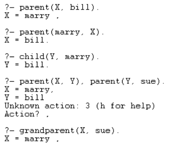

```
Họ tên: Lý Quang Thắng
MSSV: 22110202
```

## 1. Cho quan hệ parent như trong phần II, cho biết kết quả của các câu hỏi sau:

**a)**

```prolog
?- parent(jim, X).
false.
```

**b)**

```prolog
?- parent(X, jim).
X = sue.
```

**c)**

```prolog
?- parent(marry, X), parent(X, part).
false.
```

**d)**

```prolog
?- parent(marry, X), parent(X, Y), parent(Y, jim).
X = bill,
Y = sue.
```


## 2. Viết các mệnh đề Prolog diễn tả các câu hỏi liên quan đến quan hệ parent:

**a)** Ai là cha mẹ của Bill?

```prolog
?- parent(X, bill).
X = marry .
```

**b)** Marry có con không?

```prolog
?- parent(marry, X).
X = bill.

?- child(Y, marry).
Y = bill.
```

**c)** Ai là ông bà (grandparent) của Sue?

```prolog
?- grandparent(X, sue).
X = marry .
```

