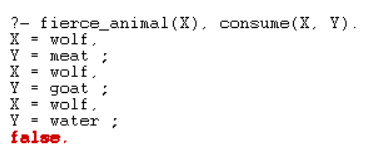

Lý Quang Thắng
22110202

## 1. 

a. Dê là động vật ăn cỏ

```pl
grass_eater(goat).
```

b. Chó sói là động vật hung dữ.
```pl
fierce_animal(wolf).
```

c. Động vật hung dữ là động vật ăn thịt.
```pl
meat_eater(X) :- fierce_animal(X).
```

d. Động vật ăn thịt thì ăn thịt và e. Động vật ăn cỏ thì ăn cỏ.
```pl
eat(X, meat) :- meat_eater(X).
eat(X, grass) :- grass_eater(X).
```

f. Động vật ăn thịt thì ăn các động vật ăn cỏ.
```pl
eat(X, Y) :- meat_eater(X), grass_eater(Y).
```

g. Động vật ăn thịt và động vật ăn cỏ đều uống nước.
```pl
drink(X, water) :- meat_eater(X).
drink(X, water) :- grass_eater(X).
```

h. Một động vật tiêu thụ cái mà nó uống hoặc cái mà nó ăn.
```pl
consume(X, Y) :- eat(X, Y).
consume(X, Y) :- drink(X, Y).
```

---

## 2. 

```pl
fierce_animal(X), consume(X, Y).
```

Kết quả

```output
X = wolf,
Y = meat ;
X = wolf,
Y = goat ;
X = wolf,
Y = water ;
false.
```

