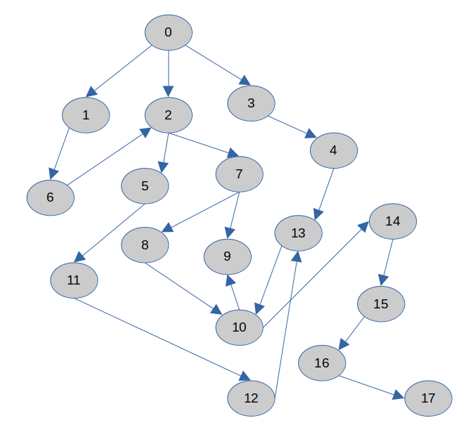
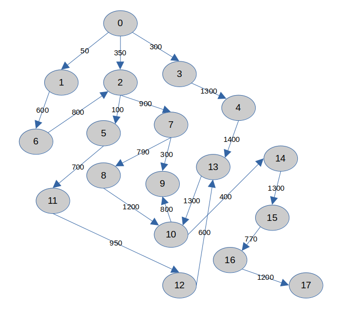

# BÀI TẬP THỰC HÀNH TUẦN 1

```
Họ tên: Lý Quang Thắng
MSSV: 22110202
```

- [BÀI TẬP THỰC HÀNH TUẦN 1](#bài-tập-thực-hành-tuần-1)
  - [1. Chạy tay thuật toán BFS, DFS và UCS](#1-chạy-tay-thuật-toán-bfs-dfs-và-ucs)
    - [1.1. BFS](#11-bfs)
    - [1.2. DFS](#12-dfs)
    - [1.3. UCS](#13-ucs)
  - [2. Kiểm tra tính đúng đắn của các thuật toán đã cho sẵn code như trên. Nếu chưa đúng thì em sửa lại như thế nào cho phù hợp?](#2-kiểm-tra-tính-đúng-đắn-của-các-thuật-toán-đã-cho-sẵn-code-như-trên-nếu-chưa-đúng-thì-em-sửa-lại-như-thế-nào-cho-phù-hợp)
    - [2.1. Sự dư thừa khi vừa khởi tạo thuật toán đã thêm node start vào visited](#21-sự-dư-thừa-khi-vừa-khởi-tạo-thuật-toán-đã-thêm-node-start-vào-visited)
    - [2.2. Sai lầm logic khi thêm các trạng thái có thể xảy ra tiếp theo vào visited](#22-sai-lầm-logic-khi-thêm-các-trạng-thái-có-thể-xảy-ra-tiếp-theo-vào-visited)
    - [2.3. Không đảm bảo cập nhật trọng số tối ưu trong Uniform Cost Search](#23-không-đảm-bảo-cập-nhật-trọng-số-tối-ưu-trong-uniform-cost-search)


## 1. Chạy tay thuật toán BFS, DFS và UCS

Ta có đồ thị từ file `Input.txt` được chuyển về dạng graph như sau:



### 1.1. BFS

Giả sử xét những node đã được thăm là những - Node x, ví dụ

- Node = 1, ...
- Node = 2, ...
- Node = 1 (tại đây không thêm 1 vào hàng đợi vì 1 đã được thăm)

Tiến hành giải tay:

- L = [0] (trạng thái ban đầu)
- Node = 0, L = [1, 2, 3], father[1, 2, 3] = 0
- Node = 1, L = [2, 3, 6], father[6] = 1
- Node = 2, L = [3, 6, 5, 7], father[5, 7] = 2
- Node = 3, L = [6, 5, 7, 4], father[4] = 3
- Node = 6, L = [5, 7, 4] (đỉnh 6 có đường đi tới đỉnh 2 nhưng đỉnh 2 đã được thăm nên bỏ qua), father[2] = 0, 6
- Node = 5, L = [7, 4, 11], father[11] = 5
- Node = 7, L = [4, 11, 8, 9], father[8, 9] = 7
- Node = 4, L = [11, 8, 9, 13], father[13] = 4
- Node = 11, L = [8, 9, 13, 12], father[12] = 11
- Node = 8, L = [9, 13, 12, 10], father[10] = 8
- Node = 9, L = [13, 12, 10]
- Node = 13, L = [12, 10] (đỉnh 13 có đường đi đến đỉnh 10 nhưng đỉnh 10 đã được thăm nên bỏ qua), father[10] = 8, 13
- Node = 12, L = [10] (đỉnh 12 có đường đi đến đỉnh 13 nhưng đỉnh 13 đã được thăm nên bỏ qua), father[13] = 4, 12
- Node = 10, L = [14] (đỉnh 10 có đường đi đến đỉnh 9 nhưng đỉnh 9 đã được thăm nên bỏ qua), father[14] = 10, father[9] = 7, 10
- Node = 14, L = [15], father[15] = 14
- Node = 15, L = [16], father[16] = 15
- Node = 16, L = [17], father[17] = 16
- Node = 17 (trạng thái kết thúc) $\to$ dừng

$\Rightarrow$ đường đi từ đỉnh 0 tới đỉnh 17 là: 

- $0\to 3\to 4\to 13\to 10\to 14\to 15\to 16\to 17$
- $0\to 2\to 7\to 8\to 10\to 14\to 15\to 16\to 17$

### 1.2. DFS

Những node đã được thăm cũng xét tương tự với thuật toán BFS

Tiến hành giải tay:

- L = [0] (trạng thái ban đầu)
- Node = 0, L = [3, 2, 1], father[3, 2, 1] = 0
- Node = 3, L = [4, 2, 1], father[4] = 3
- Node = 4, L = [13, 2, 1], father[13] = 4
- Node = 13, L = [10, 2, 1], father[10] = 13
- Node = 10, L = [14, 9, 2, 1] father[14, 9] = 10
- Node = 14, L = [15, 9, 2, 1], father[15] = 14
- Node = 15, L = [16, 9, 2, 1], father[16] = 15
- Node = 16, L = [17, 9, 2, 1], father[17] = 16
- Node = 17 (trạng thái kết thúc) $\to$ dừng

$\Rightarrow$ đường đi từ đỉnh 0 tới 17 là:

- $0\to 3\to 4\to 13\to 10\to 14\to 15\to 16\to 17$

### 1.3. UCS

Ta xét đồ thị có hướng có trọng số được chuyển đổi từ file `InputUCS.txt`



Tiến hành giải tay:

- PQ = {(0, 0)} (PQ là Priority Queue)
- PQ = {(1, 50), (3, 300), (2, 350)}
- PQ = {(3, 300), (2, 350), (6, 650)}
- PQ = {(2, 350), (6, 650), (4, 1600)}
- PQ = {(5, 450), (6, 650), (7, 1250), (4, 1600)}
- PQ = {(6, 650), (11, 1150), (7, 1250), (4, 1600)}
- PQ = {(11, 1150), (7, 1250), (4, 1600)}
- PQ = {(7, 1250), (4, 1600), (12, 2100)}
- PQ = {(9, 1550), (4, 1600), (8, 2040), (12, 2100)}
- PQ = {(4, 1600), (8, 2040), (12, 2100)}
- PQ = {(8, 2040), (12, 2100), (13, 3000)}
- PQ = {(12, 2100), (13, 3000), (10, 3240)}
- PQ = {(13, 2700), (13, 3000), (10, 3240)} có đường đi mới đến 13 có chi phí ít hơn
- PQ = {(13, 3000), (10, 3240)}
- PQ = {(10, 3240)} có đường mới đến 13 với chi phí cao hơn 13 đã có trong PQ nên bỏ qua
- PQ = {(14, 3640)}
- PQ = {(15, 4940)}
- PQ = {(16, 5710)}
- PQ = {(17, 6910)}

Vậy đường đi từ 0 đế 17 với chi phí ít nhất là:

- $0\to 2\to 7\to 8\to 10\to 14\to 15\to 16\to 17$ với chi phí là 6910

## 2. Kiểm tra tính đúng đắn của các thuật toán đã cho sẵn code như trên. Nếu chưa đúng thì em sửa lại như thế nào cho phù hợp?

### 2.1. Sự dư thừa khi vừa khởi tạo thuật toán đã thêm node start vào visited

Trong cả 3 thuật toán đã cho code sẵn đều có lỗi chung như sau:
- Thêm vào node start vào trong visited khi vừa khởi tạo các frontier, visited, parent

```python
    #### BFS ####

    visited = []
    frontier = Queue()

    # thêm node vào frontier và visited
    frontier.put(start)
    visited.append(start) # không cần thiết (sẽ viết rõ trong báo cáo)
```

```python
    #### DFS ####

    visited = []
    frontier = [] # list for stack

    # thêm node start vào frontier và visited
    frontier.append(start)
    visited.append(start) # không cần thiết (sẽ viết rõ trong báo cáo)
```

```python
    #### UCS ####

    visited = []
    frontier = PriorityQueue()
    # thêm node start vào frontier và visited
    frontier.put((0, start))
    visited.append(start) # không cần thiết (sẽ viết rõ trong báo cáo)
```

Theo em thì phần này sẽ không ảnh hưởng đến kết quả của thuật toán bởi vì ngay sau khi lệnh `visited.append(start)` này thì sẽ vào vòng lặp của thuật toán, từ đó khi node start được lấy ra khỏi `frontier` thì nó chắc chắn sẽ được thêm vào visited, ví dụ như code của BFS sau:

```python
while True:
    if frontier.empty():
        raise Exception("No way Exception")
    current_w, current_node = frontier.get()
    visited.append(current_node)
    # ...
```

Em đã thử return thêm list visited trong mỗi thuật toán và đều nhận về kết quả tương tự cho dòng lệnh này `print(visited[:3])` như sau

```output
[0, 0, 1]
```

Nghĩa là mọi lần chạy thuật toán thì start đều được append 2 lần vào visited tạo ra sự dư thừa.

Tương tự với DFS và UCS cũng như vậy, em sẽ sửa lại như sau: xóa bỏ dòng `visited.append(start)` mỗi khi khởi tạo bài toán để đỡ dư thừa trong quá trình chạy code.


- Trong vòng for để tìm các trạng thái tiếp theo mà node hiện tại đi tiếp được thì thêm các trạng thái đó vào trong visited

### 2.2. Sai lầm logic khi thêm các trạng thái có thể xảy ra tiếp theo vào visited

Trong cả 3 thuật toán em đều thấy có một phần sai lầm có thể sẽ ảnh hưởng đến thụât toán, đó là thêm các trạng thái tiếp theo có thể xảy ra từ trạng thái hiện tại dù nó chưa được duyệt vào list visited. Các code như sau:

```python
    #### BFS ####

    for node in graph[current_node]:
        if node not in visited:
            frontier.put(node)
            parent[node] = current_node
            visited.append(node) # không được phép append vào visited ở đây
```


```python
    #### DFS ####

    for node in graph[current_node]:
        if node not in visited:
            frontier.append(node)
            parent[node] = current_node
            visited.append(node) # không được phép append vào visited ở đây
```

```python
    #### UCS ####

    for nodei in graph[current_node]:
        node, weight = nodei
        if node not in visited:
            frontier.put((current_w + weight, node))
            parent[node] = current_node
            visited.append(node) # không được phép append vào visited ở đây
```

Điều này hoàn toàn sai logic, bởi vì một node được gọi là **đã thăm** khi và chỉ khi nó đã được lấy ra khỏi `frontier`. Vì vậy nếu thêm dòng `visited.append(node)` vào trong vòng lặp for thì em nghĩ nó sẽ sai về mặt logic và có thể ảnh hưởng đến kết quả của thuật toán.

Riêng trong thuật toán `Uniform Cost Search` có thể dẫn đến sai lệch kết quả. Sẽ giải thích và nêu ví dụ trong phần [2.3](#23-không-đảm-bảo-cập-nhật-trọng-số-tối-ưu-trong-uniform-cost-search)

Để sửa thì em nghĩ nên xóa bỏ dòng `visited.append(node)` trong mỗi thuật toán ở vòng for, như vậy sẽ phù hợp về mặt logic.

### 2.3. Không đảm bảo cập nhật trọng số tối ưu trong Uniform Cost Search 

Xét một ví dụ nếu vẫn giữ nguyên code và phần `visited.append(node)` ở phần [2.2](#22-sai-lầm-logic-khi-thêm-các-trạng-thái-có-thể-xảy-ra-tiếp-theo-vào-visited) thì ta sẽ gặp tình trạng sau. Thử với một đồ thị đơn giản

Đây là ví dụ 2.3.1 trong file Code

```python
graph_3 = {
    'A': [('B', 1), ('C', 5)],
    'B': [('C', 1), ('D', 4)],
    'C': [('D', 1)],
    'D': []
}

cost, path = UCS(start='A', end='D', graph=graph_3)
print("Chi phí tiêu tốn:", cost)
print("Đường đi", path) # kết quả nên là A -> B -> C -> D với chi phí = 3
```
Output:
```output
Chi phí tiêu tốn: 5
Đường đi ['A', 'B', 'D']
```

Trong khi dễ dàng quan sát được đường đi ít tốt chi phí nhất là $A \to B \to C \to D$ với chỉ 3.

Còn khi đã bỏ đi nó sẽ có chạy ra đáp án đúng, nhưng chưa đủ. Bởi vì nếu không đặt visited trong vòng for thì nó rất có thể sẽ chạy ra rất nhiều phương án không tối ưu từ đó sẽ làm mất nhiều thời gian hơn để đến được kết quả cuối cùng.

Đây là ví dụ 2.3.2 trong file Code, lưu ý rằng ví dụ đã comment dòng `visited.append(node)`:

Ta sẽ có thêm hàm `printQueue()` dùng để quan sát trạng thái của hàng đợi trong mỗi lần lặp:

```python
# Hàm printQueue hoạt động chỉ để test thử thuật toán, nó lấy tẩt cả phần tử ra xong gắn vào lại
def printQueue(q):
    tmp = PriorityQueue()
    while not q.empty():
        a = q.get()
        tmp.put(a)
        print(a, end = " ")
    print()
    return tmp
```

Và tinh chỉnh lại hàm UCS để phù hợp với việc test.

Ta có kết quả khi chạy với cùng start, end, graph như code cũ: 

```output
(0, 0)  
(50, 1)  (300, 3)  (350, 2)  
(300, 3)  (350, 2)  (650, 6)  
(350, 2)  (650, 6)  (1600, 4)  
(450, 5)  (650, 6)  (1250, 7)  (1600, 4)  
(650, 6)  (1150, 11)  (1250, 7)  (1600, 4)  
(1150, 11)  (1250, 7)  (1600, 4)  
(1250, 7)  (1600, 4)  (2100, 12)  
(1550, 9)  (1600, 4)  (2040, 8)  (2100, 12)  
(1600, 4)  (2040, 8)  (2100, 12)  
(2040, 8)  (2100, 12)  (3000, 13)  
(2100, 12)  (3000, 13)  (3240, 10)  
(2700, 13)  (3000, 13)  (3240, 10)  
(3000, 13)  (3240, 10)  (4000, 10)  
(3240, 10)  (4000, 10)  (4300, 10)  
(3640, 14)  (4000, 10)  (4300, 10)  
(4000, 10)  (4300, 10)  (4940, 15)  
(4300, 10)  (4940, 15)  
(4940, 15)  
(5710, 16)  
(6910, 17)
```

Có thể thấy ở phần 

```
(2100, 12)  (3000, 13)  (3240, 10)  
(2700, 13)  (3000, 13)  (3240, 10)  
(3000, 13)  (3240, 10)  (4000, 10)  
(3240, 10)  (4000, 10)  (4300, 10)  
(3640, 14)  (4000, 10)  (4300, 10)  
(4000, 10)  (4300, 10)  (4940, 15)  
(4300, 10)  (4940, 15)  
```

Do bỏ đi visited trong vòng for nên node số 13 và số 10 đã gây ra quá trình lặp chồng chéo nhau, do chưa được thăm.

Giải pháp: Ta cần có thêm một dictionary để lưu lại chi phí đường đi như sau

```python
cost = dict()
cost[start] = 0
```

Và điều kiện để thêm vào hàng đợi trong vòng for là

```python
for nodei in graph[current_node]:
    node, weight = nodei
    new_cost = current_w + weight

    # Nếu node chưa được thăm hoặc tìm thấy đường đi rẻ hơn
    if node not in visited and (node not in cost or new_cost < cost[node]):
        cost[node] = new_cost
        frontier.put((new_cost, node))
        parent[node] = current_node
```

Điều kiện trên nghĩa là `node` đang xét sẽ không có trong `cost`, hoặc có với chi phí đường đi mới rẻ hơn chi phí đường đi đã tồn tại trước đó