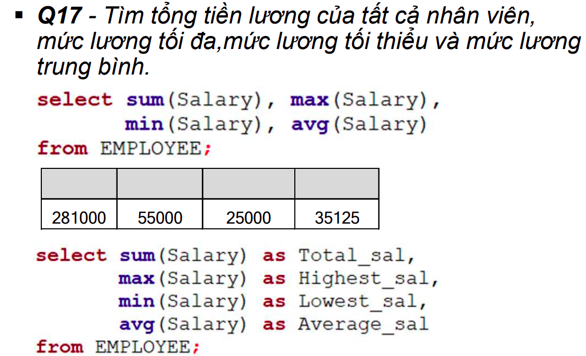

## Truy vấn đầy đủ
Các cách truy xuất dữ liệu phức tạp như:
- Nhóm các bộ dữ liệu để tóm tắt dữ liệu
- Truy xuất dữ liệu để sử dụng trong **điều kiện chọn**
- Tạo bảng kết
- Tạo bảng tạm để sử dụng trong một lệnh truy vấn
- Lựa chọn các giá trị tùy vào trường hợp

Dạng đầy đủ của lệnh truy vấn:

```sql
select <attributes>
from (<table1> join <table2> on <condition>)
where <condition>
group by <attributes>
having <condition>
order by <attributes>
```

## Hàm tổng hợp trong SQL

SQL cung cấp nhiều hàm có sẵn để tóm tắt dữ liệu:
- sum()
- max()
- min()
- avg()
- count()
- count(*): trả về số bộ dữ liệu của một nhóm

**Lưu ý**: 
- Các NULL trong cột sẽ được bỏ qua nếu áp dụng các hàm trên.
- Được sử dụng trong mệnh đề `select` hoặc `having`.



## Nhóm các bộ dữ liệu

Mệnh đề `group by`

```sql
group by <attributes>
```

- Để nhóm các bộ dữ liệu theo giá trị của một hay nhiều thuộc tính cho việc tóm tắt dữ liệu
