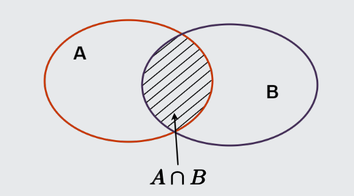

## 1. Nguyên lý cộng

Giả sử công việc A có 2 phương pháp làm
- Phương pháp 1 có $n$ cách.
- Phương pháp 2 có $m$ cách.
Vậy công việc A có $n + m$ cách làm.

Ví dụ: An có $3$ áo tay dài và $5$ áo tay ngắn. Để chọn một cái áo thì An có $3 + 5 = 8$ cách chọn

___
## 2. Nguyên lý nhân

Giả sử để làm công việc A ta cần thực hiện hai bước:
- Bước 1: Có $n$ cách làm
- Bước 2: Có $m$ cách làm
Vậy số cách làm công việc A là $n \times m$

Ví dụ: Từ các chữ số 0,1,2,3,4,5. Lập được bao nhiêu số tự nhiên chẵn có 4 chữ số
Đặt số cần lập là $\overline{abcd}$
Vì là số chẵn nên $d$ có 3 cách chọn : 0, 2, 4
$c$ có 6 cách
$b$ có 6 cách
$a$ có 5 cách : không lấy số $0$

Vậy có $3\times 6 \times 6 \times 5 = 540$
___
## 3. Nguyên lý bù trù
Cho $A$ và $B$ là hai tập hữu hạn. Khi đó
$$|A \cup B|=|A| + |B| - |A \cap B|$$
Vậy từ đó ta có
$$|A \cup B \cup C| = |A| + |B| + |C| - |A \cap B| - |A \cap C| - |B \cap C| + |A \cap B \cap C|$$

**Ví dụ 1:** Trong một lớp ngoại ngữ Anh Pháp, có 24 sinh viên học tiếng Pháp; 26
sinh viên học tiếng Anh; 15 sinh viên học tiếng Anh và tiếng Pháp. Hỏi lớp có bao
nhiêu sinh viên?

Đặt A := sinh viên học tiếng Anh $\to |A|=26$ 
Đặt B := sinh viên học tiếng Pháp $\to |B| = 24$
Ta có $A \cap B$ := sinh viên học tiếng Anh và tiếng Pháp $\to |A \cap B| = 15$

Vậy sinh viên trong lớp là $|A \cup B| = | A| + |B| - | A \cap B| = 26 + 24 - 15 = 35$ sinh viên

**Ví dụ 2:** Có bao nhiêu xâu nhị phân có độ dài 5 bit, hoặc được bắt đầu bằng 00
hoặc kết thúc bằng 1?

Số xâu bắt đầu bằng 00 là: $2^3 = 8$
Số xâu kết thúc bằng 1 là : $2^4=16$
Số xâu bắt đầu bằng 00 và kết thúc bằng 1 là: 00xx1 $\to$ có $2^2$ xâu.
Vậy số xâu hoặc bắt đầu bằng 00 hoặc kết thúc bằng 1 là: $8 + 16 - 4 = 20$

___
## 4. Nguyên lý Dirichle (Chuồng bồ câu)

### Định nghĩa:
<b style="color:red;">Giá trị trần</b> của $x$, ký hiệu là là $\left\lceil x\right\rceil$, là số nguyên nhỏ nhất mà lớn hơn hay bằng $x$.
Ví dụ: $\lceil 3.2 \rceil = 4, \lceil 2 \rceil = 2, \lceil -5.1 \rceil=-5$

<b style="color:blue;">Giá trị sàn</b> của $x$, ký hiệu là $\lfloor x \rfloor$ là số nguyên lớn nhất mà nhỏ hơn hay bằng $x$.
Ví dụ: $\left\lfloor  \frac{3}{4}  \right\rfloor = 0$

**Nguyên lý Dirichle (chuồng bồ câu)**
- Nếu nhốt $n+1$ con chim bồ câu vào $n$ chuồng thì bao giờ cũng có một chuồng chứa ít nhất $2$ con chim bồ câu.
- Nếu có $n$ vật được đặt vào trong $k$ hộp thì sẽ tồn tại một hộp chứa ít nhất $\left\lceil  \frac{n}{k}  \right\rceil$ vật.

**Ví dụ 1:**
- Có 20 chim bồ câu ở trong 7 cái chuồng. Khi đó có ít nhất 1 chuồng có 3 con chim bồ câu trở lên. 
- Nếu lấy 20 trái cam chia cho 9 người thì có ít nhất một người được từ 3 trái cam trở lên.

**Ví dụ 2:**
Cho tập $X = \{ 1,2,3,4,5,6,7,8,9 \}$. Lấy $A$ là tập hợp con của $X$ gồm 6 phần tử. Chứng tỏ trong $A$ sẽ có 2 phần tử có tổng bằng 10.

Ta lập các chuồng sau: $\{ 1,9 \}, \{ 2, 8\}, \{ 3,7 \}, \{ 4,6 \}, 5$
Do $A$ có 6 phần tử nên trong 6 phần tử đó sẽ có 2 phần tử trong 1 chuồng. Suy ra trong A sẽ có hai phần tử có tổng bằng 10.

**Ví dụ 3:** 
Có 5 đối thủ thi đấu cờ, mỗi người đấu một trận với mỗi đối thủ khác. Chứng minh rằng trong suốt thời gian thi đấu, luôn tồn tại hai đối thủ có số trận đấu bằng nhau.

Ta có số trận đấu của mỗi người có thể là 0, 1, 2, 3, 4. Nhưng vì không thể có cùng lúc một người đã đấu 4 trận và một người chưa chơi trận nào $\implies$ có tối đa 4 loại số trận đã đấu.
Vận dụng nguyên lý dirichle: Tồn tại ít nhất $\left\lceil  \frac{5}{4}  \right\rceil = 2$ người có số trận đấu bằng nhau. 

___
## 5. Hoán vị

Cho $A$ gồm $n$ phần tử. Mỗi cách sắp đặt *có thứ tự* $n$ phần tử của $A$ được gọi là một hoán vị của của $n$ phần tử.
Số cách hoán vị của $n$ phần tử, ký hiệu $P_{n}$ là:
$$P_n=n!=n\times(n-1)\times(n-2)\times...\times1$$

Quy ước: $0! = 1$

**Ví dụ:** Cho $A = \{ 1, 2, 3 \}$ thì $A$ có các hoán vị sau:
$$123, 132, 213, 231, 312, 321$$
___
## 6. Chỉnh hợp

Cho tập hợp $A$ gồm $n$ phần tử. Mỗi bộ gồm *sắp thứ tự gồm* $k$ phần tử ($1 \leq k \leq n$) của tập hợp $A$ được gọi là một `chỉnh hợp chập k của n` phần tử. Số cách `chỉnh hợp chập k của n` ký hiệu là $A^k_{n}$
$$A^k_{n}= \frac{n!}{(n-k)!}$$
**Ví dụ:** Mỗi lớp trong học kỳ I phải học 12 môn khác nhau, mỗi ngày học 3 môn.
Hỏi có bao nhiêu cách sắp xếp thời khóa biểu trong ngày?

Xếp 3 môn khác nhau trong số 12 môn là một sắp xếp có thứ tự. Như vậy, số cách xếp là: 
$$A^3_{12} = \displaystyle{\frac{12!}{(12-3)!}}=1320$$
___
## 7. Tổ hợp

Cho tập $A$ gồm $n$ phần tử. Mỗi tập con gồm $k$ phần tử của $A$ được gọi là một `tổ hợp chập k của n` phần tử.
Ký hiệu: $C^k_{n} = \left(\begin{matrix} n \\ k \end{matrix}\right)$

Công thức:

$$C^k_{n} = \frac{A^k_{n}}{k!} = \frac{n!}{k!(n-k)!}$$

Một số tính chất

$$C^{n-k}_{n} = C^k_{n}$$

$$C^k_{n} + C^{k-1}_{n} = C^{k}_{n+1}$$

**Ví dụ:** Mỗi đề thi gồm có 5 câu hỏi khác nhau chọn từ ngân hàng 50 câu hỏi đã
cho. Hỏi có thể thành lập được bao nhiêu đề thi khác nhau?

Có $C^5_{50}$ đề thi khách nhau được thành lập

___
## 8. Giải tích tổ hợp

**Ví dụ:** Từ các số của tập $A = \{2; 4; 6; 8\}$ lập được bao nhiêu số tự nhiên gồm bảy
chữ số, trong đó chữ số 2 xuất hiện đúng hai lần, chữ số 4 xuất hiện 2 lần, chữ số
6 xuất hiện 2 lần và chữ số 8 xuất hiện 1 lần.

Số có 7 chữ số thỏa mãn: só 2 xuất hiện đúng **hai lần**, số 4 xuất hiện đúng **2 lần**, số 6 xuất hiện đúng **2 lần**, số 8 xuất hiện **1 lần**.

- Ta có $C^2_{7}$ cách chọn vị trí cho số 2, còn lại 5 vị trí
- Ta có $C^2_{5}$ cách chọn vị trí cho số 4, còn lại 3 vị trí
- Ta có $C^2_{3}$ cách chọn vị trí cho số 6, còn lại 1 vị trí
- Và cuối cùng có $C^1_{1}$ cách chọn vị trí cho số 8.
Theo nguyên lý nhân, số cách chọn ra số có 7 chữ số thỏa yêu cầu đề bài là:  
$$C^2_{7} \times C^2_{5} \times C^2_{3} \times C^{1}_{1} = 630$$

___
## 9. Hoán vị lặp
### Định nghĩa
Cho n đối tượng trong đó có $n_{i}$ đối tượng loại $i$ ($1 < i < k$) giống hệt nhau, nghĩa là:
$$n_{1} + n_{2} + \dots + n_{k} = n$$
Mỗi cách sắp xếp có thứ tự $n$ đối tượng đã cho gọi là một *hoán vị lặp*. Số hoán vị lặp trong trường hợp trên là: 
$$P_{n}(n_{1}, n_{2}, \dots, n_{k}) = \frac{n!}{n_{1}!\times n_{2}! \times n_{3}! \dots \times n_{k}!}$$
### Ví dụ
**Ví dụ:**
Từ các số của tập $A = \{2; 4; 6; 8\}$ lập được bao nhiêu số tự nhiên gồm bảy
chữ số, trong đó chữ số 2 xuất hiện đúng hai lần; chữ số 4 xuất hiện 2 lần; chữ số
6 xuất hiện 2 lần và chữ số 8 xuất hiện 1 lần.

Theo quy tắc hoán vị lặp có tất cả:
$$P_{7}(2,2,2,1) = \frac{7!}{2! \times 2! \times 2! \times 1!} = 630 \text{ số thỏa mãn}$$

**Ví dụ:** Có bao nhiêu hoán vị của chuỗi MISSISSIPPI?

Chuỗi trên có 11 ký tự. Chữ M xuất hiện 1 lần, chữ I xuất hiện 4 lần, chữ S xuất hiện 4 lần và chữ P xuất hiện 2 lần
Theo quy tắc hoán vị lặp có tất cả:
$$P_{11}(1,4,4,2)=\frac{11!}{1! \times 4! \times 4! \times 2!} = 34650 \text{ hoán vị}$$

**Ví dụ:** Với các chữ số 0, 1, 2, 3, 7, 9 có thể lập được bao nhiêu số gồm 8 chữ số,
trong đó chữ số 1 có mặt 3 lần, mỗi chữ số khác có mặt đúng một lần?.

Theo quy tắc hoán vị lặp có tất cả:
$$P_{8}(3,1,1,1,1,1) = \frac{8!}{3!}=6720$$
**Ví dụ:** Cho tập A = {2, 4, 5, 6, 7}. Hỏi từ tập A lập được bao nhiêu số có 7 chữ số
sao cho chữ số 4 xuất hiện 2 lần, chữ số 5 xuất hiện 2 lần, các số khác xuất hiện
đúng 1 lần và số đó chia 2 thì dư 1.

Trường hợp 1: Số cuối cùng là 5
Thì ta chỉ cần xét 6 số đầu tiên sao cho có 2 số 4, có 1 số 5, và các số khác xuất hiện 1 lần.
$$P_{6}(2,1,1,1,1) = 360$$
Trường hợp 2: Số cuối cùng là 7
Thì ta chỉ cần xét 6 số đầu tiên sao cho có 2 số 4, 2 số 5 và các số khác xuất hiện 1 lần
$$P_{6}(2,2,1,1)=180$$
Theo nguyên lý cộng thì có $360 + 180 = 540$ số.
___
## 10. Chỉnh hợp lặp

Cho tập A là tập hợp gồm $n$ phần tử. **Chỉnh hợp lặp** chập k của n phần tử là một bộ sắp thứ tự k phần tử của A, các phần tử có thể lặp lại. Số chỉnh hợp lặp chập k của n phần tử là $n^k$

**Ví dụ:** Có bao nhiêu chuỗi có độ dài r có thể được hình thành từ những chữ cái
hoa trong bảng chữ cái tiếng Anh?

Mỗi chữ cái có 26 lựa chọn. Suy ra theo chỉnh hợp lặp có $26^r$ chuỗi có độ dài $r$.

**Ví dụ:** Xếp ngẫu nhiên 5 quyển sách vào 3 ngăn kéo. Hỏi có bao nhiêu cách xếp?

Mỗi một quyển sách có 3 lựa chọn ngăn kéo. Vậy theo chỉnh hợp lặp có $3^5$ cách.

**Ví dụ:** Biển đăng kí ôtô có 6 chữ số và 2 chữ cái đầu tiên trong 26 chữ cái (không
dùng chữ O và I ). Hỏi số ôtô được đăng kí nhiều nhất là bao nhiêu?

Đầu tiên xác định 2 chữ cái đầu: Có $24^2$ cách chọn 2 chữ cái đầu tiên (ko tính O và I)
Tiếp theo xác định 6 chữ số sau: {0,1,2,3,4,5,6,7,8,9}: Có $10^6$ cách chọn ra 6 chữ số sau.
Vậy theo nguyên lý nhân có $24^2 \times 10^6 = 576000000$ cách chọn ra biển số xe.
___
### 11. Tổ hợp lặp

### Định nghĩa
Mỗi cách chọn ra $r$ vật từ $n$ loại vật khác nhau (trong đó mỗi loại vật có thể được chọn lại nhiều lần) được gọi là **tổ hợp lặp** chập *r* của *n*.
Số tổ hợp chập $r$ của $n$ được ký hiệu là $K^r_{n}$
$$K^r_{n} = C^r_{n+r-1}=C^{n-1}_{{n+r-1}}$$
### Hệ quả:
Số nghiệm nguyên không âm $(x_{1},x_{2},x_{3},\dots,x_{n})$ của phương trình
$$x_{1} + x_{2} + x_{3}  + \dots + x_{n} = r$$
là $K^r_{n}=C^r_{n+r-1}$
### Ví dụ:

**Ví dụ:** Có bao nhiêu cách để chọn 4 quả từ một đĩa chứa táo, cam, lê nếu thứ tự
các quả được chọn không quan trọng, chỉ quan trọng loại quả và số lượng quả, và
có ít nhất bốn quả mỗi loại trong đĩa?

Cách để chọn ra 4 quả từ mỗi đĩa là số tổ hợp lặp chập 4 từ tập 3 phần tử Táo, Cam, Lê

$$K^r_{n}=C^{n-1}_{n+r-1} = C^{3-1}_{3+4-1}=15$$

**Ví dụ:** Có bao nhiêu cách chọn 10 phần quà từ một cửa hàng có 21 phần quà
khác nhau?

Số cách chọn 10 phần quả là số tổ hợp lặp chập 10 của 21:

$$C^{n-1}_{n+r-1}=C^{20}_{20+10-1}=30045015$$

**Ví dụ:** Phương trình dưới đây có bao nhiêu lời giải: $x_1 + x_2 + x_3 = 11$ trong đó
$x_1 , x_2 , x_3$ là các số nguyên không âm?

Một nghiệm của phương trình là tương ứng với một cách lấy ra 11 phần tử
từ một tập có 3 loại phần tử sao cho có
- $x_{1}$ phần tử loại 1
- $x_{2}$ phần tử loại 2
- $x_{3}$ phần tử loại 3
Do đó, số nghiệm phương trình bằng số tổ hợp chặp 11 của một tập có 3 phần tử
$$C^{n-1}_{n+r-1} = C^2_{13}= 78$$

